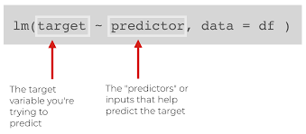

class: title-slide, center, middle

<link rel="stylesheet" href="https://use.fontawesome.com/releases/v5.6.0/css/all.css" integrity="sha384-aOkxzJ5uQz7WBObEZcHvV5JvRW3TUc2rNPA7pe3AwnsUohiw1Vj2Rgx2KSOkF5+h" crossorigin="anonymous">


```{r setup, echo = FALSE, message = FALSE, waning = FALSE, error = FALSE}
knitr::opts_chunk$set(fig.retina = 3, warning = FALSE, message = FALSE)
extrafont::loadfonts()
library(readxl)
library(tidyverse)
library(patchwork)
library(here)

library(palmerpenguins)
data("penguins")
```

<style>

.center2 {
  margin: 0;
  position: absolute;
  top: 50%;
  left: 50%;
  -ms-transform: translate(-50%, -50%);
  transform: translate(-50%, -50%);
}

.rcorners1 {
  margin: auto;
  border-radius: 25px;
  background: #ada500;
  padding: 10px;
#  width: 50%;
}
</style>

```{css echo=FALSE}
.right-column{
  padding-top: 0;
}

.remark-code, .remark-inline-code { font-family: 'Source Code Pro', 'Lucida Console', Monaco, monospace;
                                    font-size: 90%;
                                  }

```


<div class="my-logo-left">  </div>
<div class="my-logo-right">  </div>


# INPUT - OUTPUT Workshop R & RStudio
.font160[
.SW-greenD[Deel 5]
]
.font120[
.SW-greenD[*Enkele typische statistische analyses in *] .UA-red[*`R`*]
]
Sven De Maeyer

.font80[
.UA-red[
03/05/2022
]
]

---
class: inverse-green, left

# Overzicht

.center2[

- Correlatie --- ([doorklikken](#part1))
- Lineaire regressie --- ([doorklikken](#part2))
]

---
class: inverse-green, center, middle
name: part1

# 1. Correlatie

---

## De .UA-red[`cor( )`] functie

.pull-left[
```{r, eval = T, echo = F, fig.width = 5, fig.height=5}
penguins %>%
  ggplot(
    aes(y = flipper_length_mm, x = body_mass_g)
  ) +
  geom_point() +
  labs(
    title = "Palmer Penguins",
    subtitle = "Body mass afgezet tegen Flipper lengte",
    y = "Flipper lengte (mm)",
    x = "Body mass (gr)"
      ) +
  theme_minimal() +
  theme(
    plot.title.position = "plot"
  )
  

```
]

.pull-right[
.UA-red[Let op voor NA's!!]
.footnotesize[
```{r}
library(palmerpenguins)
data("penguins")

cor(penguins$flipper_length_mm, 
    penguins$body_mass_g)

cor(penguins$flipper_length_mm, 
    penguins$body_mass_g, 
   use = "complete.obs")
```
]
]

---

## Statistische test met .UA-red[`cor.test( )`] functie

```{r}
cor.test(penguins$flipper_length_mm, 
        penguins$body_mass_g)
```

---
<div class="my-logo-right">  </div>

## .UA-red[`broom`]  pakket

- Pakket in `tidyverse` 

- Output van verschillende statistische methoden op een gelijkaardige wijze omzetten naar .SW-greenD[**tidy**] format!

.UA-red[`tidy()`]: alle belangrijke output als tabel meegeven

```{r}
library(broom)
C <- cor.test(penguins$flipper_length_mm, 
        penguins$body_mass_g)

tidy(C)
```

---

## Correlaties tussen meerdere variabelen

```{r}
penguins %>% 
  select(
    bill_depth_mm,
    bill_length_mm,
    flipper_length_mm,
    body_mass_g
  ) %>%
  cor(use = "pairwise.complete.obs")
```

---

## Correlaties tussen meerdere variabelen visueel

.pull-left[
Pakket: .UA-red[`GGally`]

Functie: .UA-red[`ggpairs()`]

Resultaat: een ggplot object...

.footnotesize[
```{r, eval = F}
library(GGally)
penguins %>% 
  select(
    species,
    bill_depth_mm,
    bill_length_mm,
    flipper_length_mm,
    body_mass_g
  ) %>%
  ggpairs(
    columns = c(
      "flipper_length_mm", "body_mass_g",
      "bill_length_mm", "bill_depth_mm")
    )
```
]
]

.pull-right[
```{r, echo = F}
library(GGally)
penguins %>% 
  select(
    species,
    bill_depth_mm,
    bill_length_mm,
    flipper_length_mm,
    body_mass_g
  ) %>%
  ggpairs(
    columns = c("flipper_length_mm", "body_mass_g",
                "bill_length_mm", "bill_depth_mm"))
```
]

---

## Correlaties tussen meerdere variabelen visueel MET KLEUR!


.pull-left[

.footnotesize[
```{r, eval = F}
penguins %>% 
  select(
    species,
    bill_depth_mm,
    bill_length_mm,
    flipper_length_mm,
    body_mass_g
  ) %>%
  ggpairs(
    aes(color = species),
    columns = c(
      "flipper_length_mm", "body_mass_g",
      "bill_length_mm", "bill_depth_mm")) +
  scale_colour_manual(
    values = c("darkorange","purple","cyan4")) +
  scale_fill_manual(
    values = c("darkorange","purple","cyan4"))
```
]
]

.pull-right[
```{r, eval = T, echo  = F}
penguins %>% 
  select(
    species,
    bill_depth_mm,
    bill_length_mm,
    flipper_length_mm,
    body_mass_g
  ) %>%
  ggpairs(
    aes(color = species),
    columns = c("flipper_length_mm", "body_mass_g",
                "bill_length_mm", "bill_depth_mm")) +
  scale_colour_manual(values = c("darkorange","purple","cyan4")) +
  scale_fill_manual(values = c("darkorange","purple","cyan4"))
```
]

---
class: inverse-green, center, middle
name: part2

# 2. Lineaire regressie

---

## .UA-red[`lm()`]

```{r, out.height = "50%", out.width="50%", eval = T, echo = F}

```


```{r eval = T, echo = T}
Model1 <- lm(flipper_length_mm ~ body_mass_g, 
             data = penguins)
```


---

## Model resultaten bekijken met .UA-red[`summary()`]

.footnotesize[
```{r}
summary(Model1)
```
]

---
<div class="my-logo-right">  </div>

## .UA-red[`broom`]  pakket

Functie: .UA-red[`tidy()`]

Resultaat: tidy dataset met informatie over schattingen

```{r}
tidy(Model1, 
     conf.int = TRUE,
     conf.level = .90)
```

---
<div class="my-logo-right">  </div>

## .UA-red[`broom`]  pakket

Functie: .UA-red[`glance()`]

Resultaat: tidy dataset met model fit gegevens

```{r}
glance(Model1)
```

---
<div class="my-logo-right">  </div>

## .UA-red[`broom`]  pakket

Functie: .UA-red[`augment()`]

Resultaat: aan de originele data extra informatie toevoegen op basis van het model (geschatte waarden; residuelen; ...)

```{r}
augment(Model1)
```

---
<div class="my-logo-right">  </div>

## .UA-red[`broom`]  pakket

Functie: .UA-red[`augment()`] + .UA-red[`geom_histogram()`]

Resultaat: Residuelen normaal verdeeld?

.pull-left[
```{r, eval = F}
augment(Model1) %>% 
  select(.resid) %>% 
  ggplot(
    aes(
      x = .resid
    )
  ) + 
  geom_histogram() + 
  theme_minimal() +
  labs(
    title = "Model1",
    subtitle = "Verdeling van de residuelen"
  ) +
  theme(plot.title.position = "plot")
```
]

.pull-right[
```{r, echo = F, eval = T, fig.width=4, fig.height=4, fig.align='center'}
augment(Model1) %>% 
  select(.resid) %>% 
  ggplot(
    aes(
      x = .resid
    )
  ) + 
  geom_histogram() + 
  theme_minimal() +
  labs(
    title = "Model1",
    subtitle = "Verdeling van de residuelen"
  ) +
  theme(plot.title.position = "plot")
```
]

---
<div class="my-logo-right">  </div>

## .UA-red[`broom`]  pakket

Functie: .UA-red[`augment()`] + .UA-red[`geom_histogram()`]

Resultaat: Residuelen normaal verdeeld?

.pull-left[
```{r, eval = F}
augment(Model1) %>% 
  select(.fitted, .std.resid) %>% 
  ggplot(
    aes(
      x = .fitted,
      y = .std.resid
    )
  ) + 
  geom_point() + 
  theme_minimal() +
  labs(
    title = "Model1",
    subtitle = "Fitted values vs residuals"
  ) + geom_hline(yintercept = 0) +
  theme(plot.title.position = "plot")
```
]

.pull-right[
```{r, echo = F, eval = T, fig.width=4, fig.height=4, fig.align='center'}
augment(Model1) %>% 
  select(.fitted, .std.resid) %>% 
  ggplot(
    aes(
      x = .fitted,
      y = .std.resid
    )
  ) + 
  geom_point() + 
  theme_minimal() +
  labs(
    title = "Model1",
    subtitle = "Fitted values vs residuals"
  ) + geom_hline(yintercept = 0) +
  theme(plot.title.position = "plot")
```
]

---
<div class="my-logo-right">  </div>

## .UA-red[`broom`]  pakket

Functie: .UA-red[`augment()`] + .UA-red[`geom_histogram()`]

Resultaat: Residuelen normaal verdeeld?

.pull-left[
```{r, eval = F}
augment(Model1) %>% 
  select(.fitted, .std.resid) %>% 
  ggplot(
    aes(
      x = .fitted,
      y = .std.resid
    )
  ) + 
  geom_point() + 
  theme_minimal() +
  labs(
    title = "Model1",
    subtitle = "Fitted values vs residuals"
  ) + geom_hline(yintercept = 0) +
  theme(plot.title.position = "plot")
```
]

.pull-right[
```{r, echo = F, eval = T, fig.width=4, fig.height=4, fig.align='center'}
augment(Model1) %>% 
  select(.fitted, body_mass_g) %>% 
  ggplot(
    aes(
      x = body_mass_g,
      y = .fitted
    )
  ) + 
  geom_line() + 
  theme_minimal() +
  labs(
    title = "Model1",
    subtitle = "Geschatte waarden afgezet tegen body mass",
    x = "body mass (g)",
    y = "geschatte waarden"
  )  +
  theme(plot.title.position = "plot")
```
]

---

## Lineair model met meerdere voorspellers

.footnotesize[
```{r}
Model2 <- lm(
  flipper_length_mm ~ body_mass_g + sex + species,
  data = penguins
)

tidy(Model2)
```
]

---

## Modellen vergelijken

Model fit informatie van meerdere modellen op een rijtje zetten:

```{r}

M1_info <- glance(Model1) %>% select(r.squared, AIC, BIC)
M2_info <- glance(Model2) %>% select(r.squared, AIC, BIC)

M1_info %>% rbind(M2_info)


```

---

## Model visualiseren

.pull-left[
.footnotesize[
```{r, eval=FALSE}
augment(Model2) %>%
  ggplot() +
  geom_point(
    aes(x = body_mass_g,
        y = flipper_length_mm,
        color = sex),
    alpha = .6
  ) +
  geom_line(
    aes(
      x = body_mass_g,
      y = .fitted,
      color = sex,
    ),
    size = 1.5
  ) +
  facet_wrap(.~species) +
  theme_minimal()
```
]
]

.pull-right[
```{r, echo = F, fig.align='center', fig.width=7, fig.height=5}
augment(Model2) %>%
  ggplot() +
  geom_point(
    aes(x = body_mass_g,
        y = flipper_length_mm,
        color = sex),
    alpha = .6
  ) +
  geom_line(
    aes(
      x = body_mass_g,
      y = .fitted,
      color = sex
    ),
    size = 1.5
  ) +
  facet_wrap(.~species) +
  theme_minimal()
```
]
