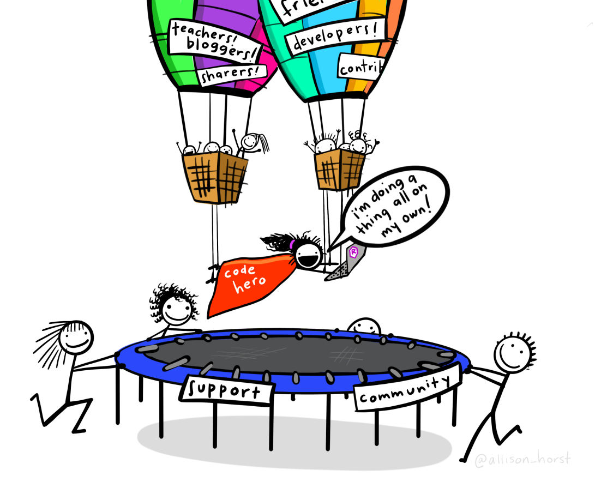
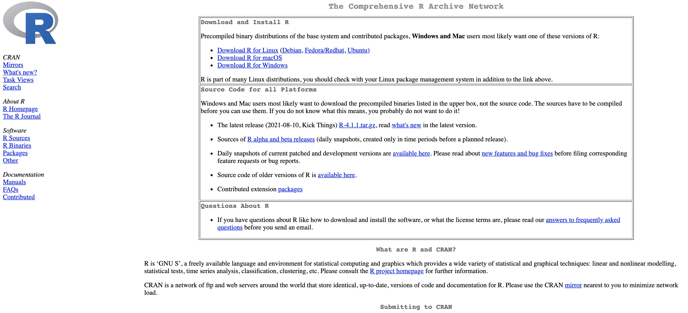
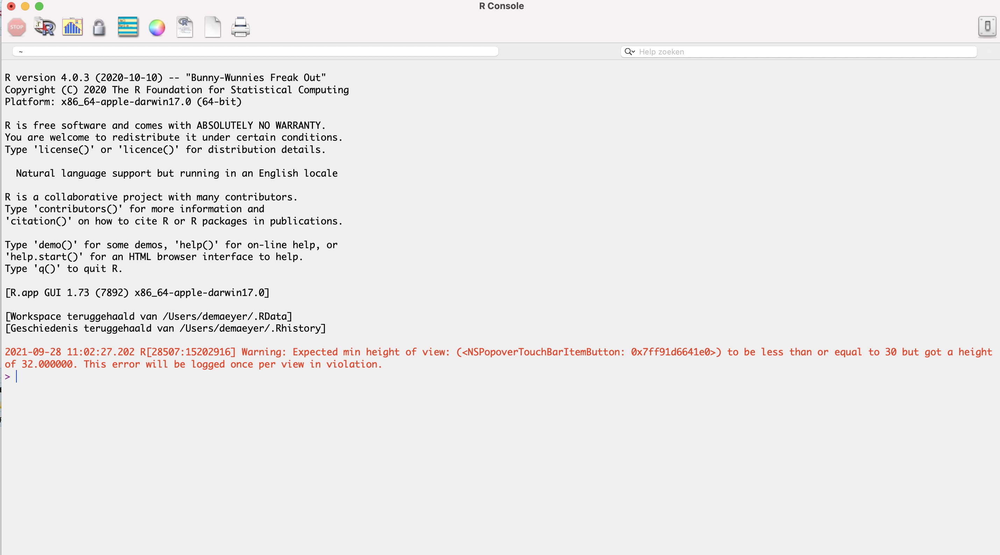
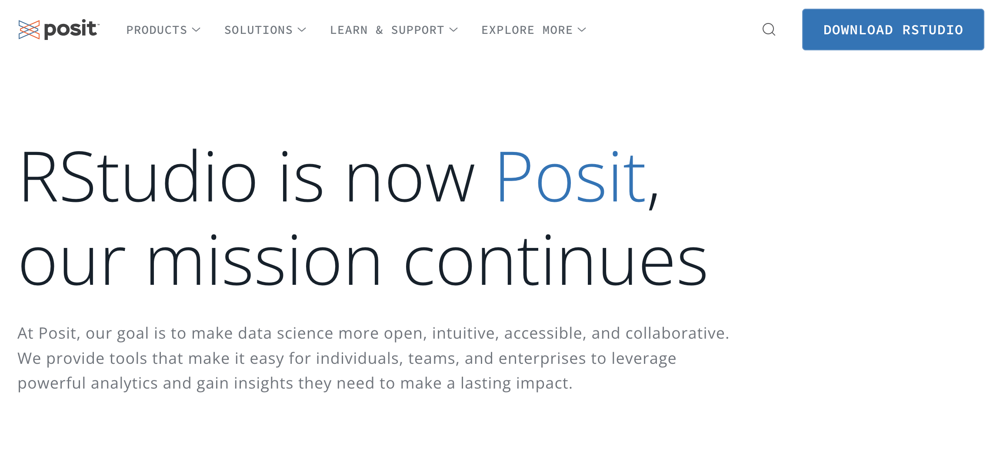
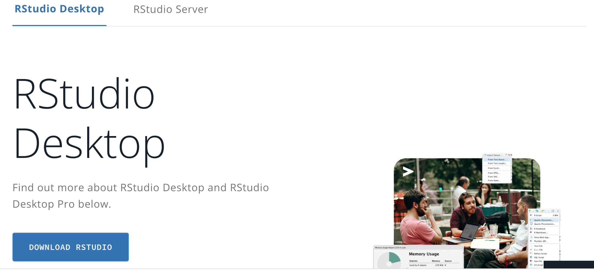
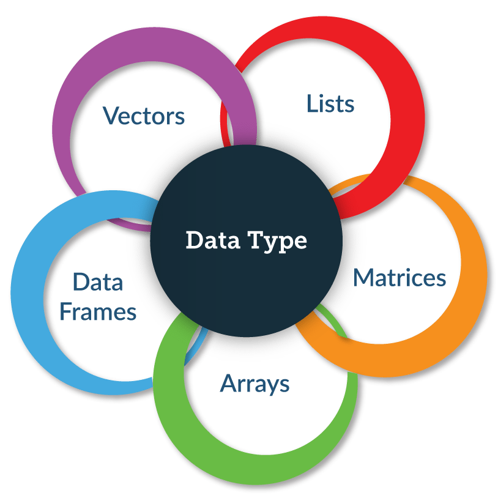
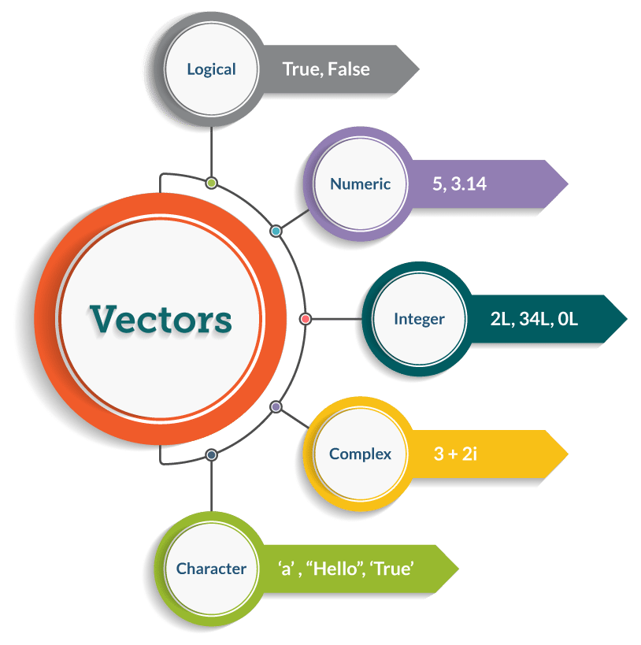
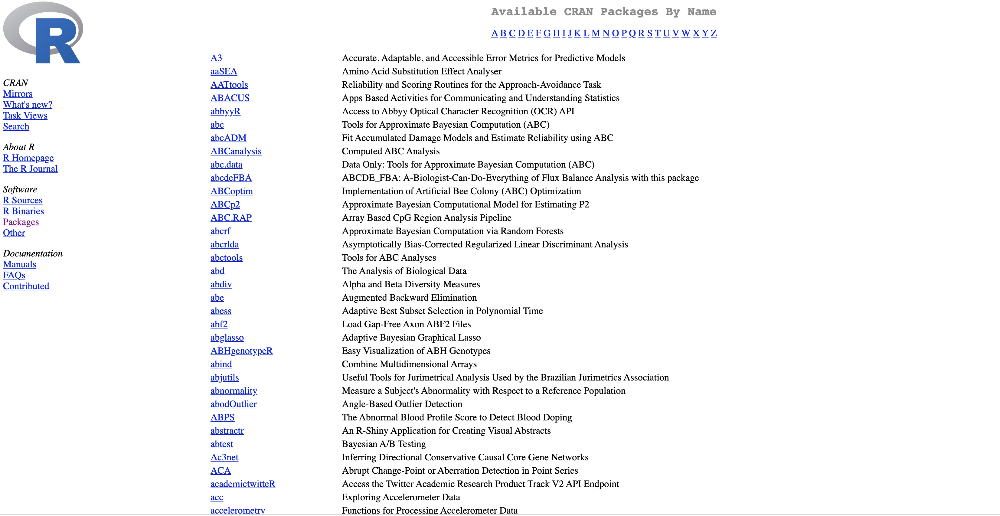
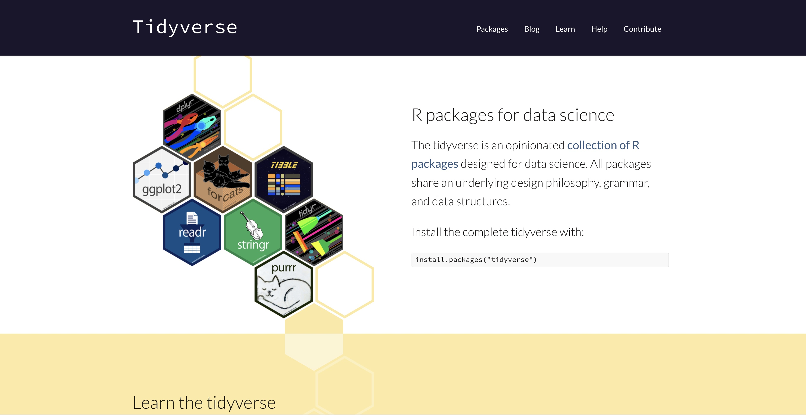
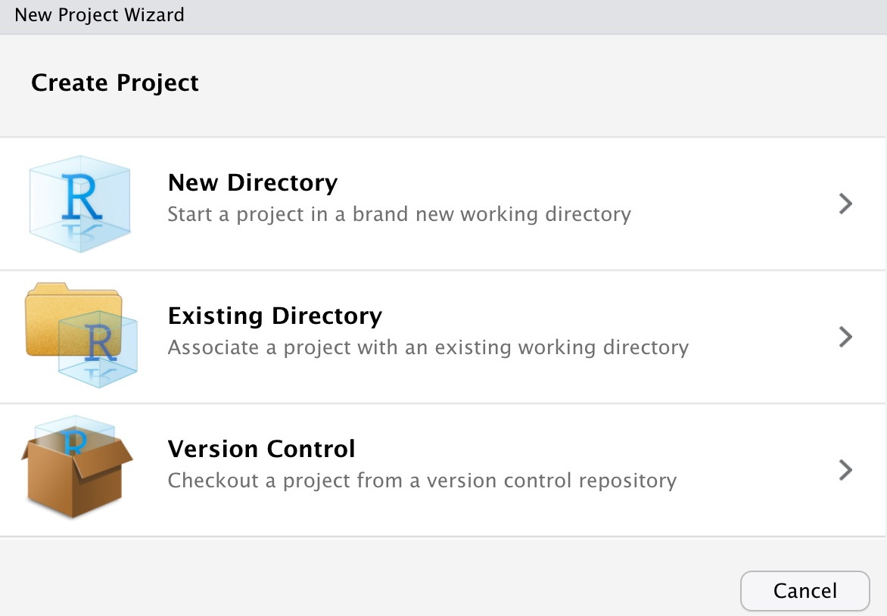

class: title-slide, center, middle

<link rel="stylesheet" href="https://use.fontawesome.com/releases/v5.6.0/css/all.css" integrity="sha384-aOkxzJ5uQz7WBObEZcHvV5JvRW3TUc2rNPA7pe3AwnsUohiw1Vj2Rgx2KSOkF5+h" crossorigin="anonymous">


```{r setup, echo = FALSE, message = FALSE, waning = FALSE, error = FALSE}
knitr::opts_chunk$set(fig.retina = 3, warning = FALSE, message = FALSE)
extrafont::loadfonts()
```

<style>

.center2 {
  margin: 0;
  position: absolute;
  top: 50%;
  left: 50%;
  -ms-transform: translate(-50%, -50%);
  transform: translate(-50%, -50%);
}

.rcorners1 {
  margin: auto;
  border-radius: 25px;
  background: #ada500;
  padding: 10px;
#  width: 50%;
}
</style>

```{css echo=FALSE}
.right-column{
  padding-top: 0;
}

.remark-code, .remark-inline-code { font-family: 'Source Code Pro', 'Lucida Console', Monaco, monospace;
                                    font-size: 90%;
                                  }

```


<div class="my-logo-left">  </div>
<div class="my-logo-right">  </div>

# ICO Workshop R & RStudio
.font160[
.SW-greenD[Part 1]
]
.font120[
.SW-greenD[*Introduction to R and RStudio*]
]
Sven De Maeyer & Tine van Daal

.font80[
.UA-red[
2nd - 4th July, 2024
]
]

---
class: inverse-green, left

# Overzicht

.center2[
1. Some practical stuff --- ([click here](#part1))
2. What is `R` and why should you use `R`? --- ([click here](#part2))
3. Install `R` & `RStudio` --- ([click here](#part3))
4. `RStudio` interface --- ([click here](#part4))
5. The basics in `R` ([click here](#part5))
6. Installing and using packages --- ([click here](#part6))
7. Importing data --- ([click here](#part7))
8. Working with `R`-projects --- ([click here](#part8))

]

---
background-image: url(img/despicable_me2.jpeg)
background-size: contain
class: inverse

## .yellow[About us]

- University of Antwerp;  Faculty of Social Sciences; dept. Training- en Education Sciences
- dieha`R`d use`R`s of `R`

.pull-left[
**About Sven?**
- *Research interests?* .font80[Psychometry, writing research, learning strategies, education for sustainable development, linguistics, ...]
- *Main focus?* .font80[Comparative Judgement + Learning from comparisons]  
<br>  
Blog: https://svendemaeyer.netlify.app/  
Twitter: @svawa  
github: https://github.com/Sdemaeyer2  
]

.pull-left[
**About Tine?**
- *Research interests?* .font80[Comparative judgement, learning from complementary texts, assessment with technology, replication studies, data visualisation, ... ]
- *Main focus?* .font80[(Peer) assessment, learning processes, educational technology, learning analytics]
<br> 
<br>  
Twitter: @TinevanDaal  
github: https://github.com/tvdaal  
]

<br>
<br>
<br>

---
background-image: url(img/we_like_you_too.jpg)
background-size: contain
class: inverse, center, bottom


## .green[Getting to now each other...]

.black[Your position?]

.black[Research?]

.black[Expectations?]

<br><br><br>

---
class: inverse-green, center, middle
name: part1

# 1. Some practical stuff

---
<div class="my-logo-right">  </div>

## Materials

<br>

Various types of files:

- Rmd-files (for slides)   (.font80[*.Rmd*])

- Qmd-files (for exercises) (.font80[*.Qmd*])

- R-scripts (as example) (.font80[*.R*])

- data sets (.font80[*.sav, .csv, ...*])

- html-version of slides and exercises   (.font80[*.html*])

<br>

All these files can be found at the **Open Science Framework**

---

## At wo`R`k
<br>  
<br>    
We will provide you with the necessary information to start coding yourself.

.big[🙏] *Make it interactive! Feel free to ask questions!* 

<br>

Of course, we will also put you to wo`R`k! Do you get stuck? Is `R` not working along?

.big[🙏] *Do not hesitate to ask our help!*

---
class: inverse-green, center, middle
name: part2

# 2. What is `R` and why should you use `R`?

---

<div class="my-logo-right">  </div>


## What is `R`?

.pull-left[
Powerful tool for:
- Data Science
- Statistical analysis
- Statistical programming
- Data visualisation
  ...

A 'language'

$\rightarrow$ We will have to learn some **vocabulary** and **grammar** ...
]
.pull-right[
```{r echo=FALSE, out.height = "80%", out.width="80%"}

```
]
---

<div class="my-logo-right">  </div>


## Why `R`?

- Free AND open source!  

- In constant development  

- Thousands of "add-ins" (packages)  

- Almost every algorithm and technique is implemented in `R`

- `R` is ahead of commercial statistical software

- Can facilitate reproducibility and open science practices

- Large community  (Help will always be given ...)

---
class: inverse-green, center, middle
name: part3

# 3. Install `R` and `RStudio`

---

<div class="my-logo-right">  </div>

## Install `R` 

https://cran.r-project.org/


```{r, out.height = "80%", out.width="80%", eval = T, echo = F}

```

<i class="fas fa-angle-double-right" style="color: #FF0035;"></i> .red[*In case you haven't already installed `R`. Do it now! Are you stuck? Let us know.*]

---
<div class="my-logo-right">  </div>

## A quick tour in `R` ...

```{r, out.height = "80%", out.width="80%", eval = T, echo = F}

```

---

<div class="my-logo-right">  </div>

## Install `RStudio`

.pull-left[
Go to https://posit.co/  

Click on  *Download `RStudio`*
] 

.pull-right[
```{r, out.height = "90%", out.width="90%", eval = T, echo = F}

```
]

---
<div class="my-logo-right">  </div>

## Install `RStudio`

.pull-left[

Click on  *Download `RStudio`*
] 

.pull-right[
```{r, out.height = "90%", out.width="90%", eval = T, echo = F}

```
]

---
<div class="my-logo-right">  </div>

## Install `RStudio`

.pull-left[

Scroll down

Click on  *Download `RStudio`*

Choose the right operating and download `RStudio`
]

.pull-right[

```{r, out.height = "80%", out.width="80%", eval = T, echo = F}

```

<i class="fas fa-angle-double-right" style="color: #FF0035;"></i> .red[*In case you haven't already installed `RStudio`. Do it now! Are you stuck? Let us know.*]
] 

]
---
class: inverse-green, center, middle
name: part4

# 4. `RStudio` interface

---
class: inverse-blue, center, middle

# `RStudio` environment

.rcorners1[
.Large[
<i class="fas fa-desktop" style="color: #FF0035;"></i> * Let us discover `RStudio` together!*
]
]

---
class: inverse-green, center, middle
name: part5

# 5. The basics in `R`

---

## Type of objects

<br>
.pull-left[
- *vectors*

- matrices

- arrays

- *data frames*

- lists

- *functions*

...
]

.pull-right[

```{r, out.height = "80%", out.width="80%", eval = T, echo = F}

```
]

.footnote[.small[
<i class="fas fa-link" style="color: #FF0035;"></i> * Figure from https://www.edureka.co/blog/r-programming-language *]
]

---

### Vectors

```{r, out.height = "40%", out.width="40%", eval = T, echo = F}

```


<br>

.footnote[
.small[
<i class="fas fa-link" style="color: #FF0035;"></i> * Figure from https://www.edureka.co/blog/r-programming-language *
]
]

---
class: inverse-blue, center, middle

## First steps in `R` ; let's make a script ...
.rcorners1[.Large[
<i class="fas fa-code" style="color: #FF0035;"></i> * Time to get started with the real work and code together*
]
.small[You can find the code on the next slides.

There is also a script `Fruit.R` that contains the same code (see `Dropbox/VLHORA_R_2021/R_scripts`)]
]

---

### <i class="fas fa-code" style="color: #FF0035;"></i> .SW-greenD[Code-Blocks: character vector]

We create a vector and call it _.UA-blue[Fruit]_  
.small[
```{r, echo=TRUE, eval = TRUE}
Fruit <- c("Apples", "Bananas", "Lemons", "Berries", "Peaches", NA)
```
]
.font80[
- .UA-red[`c()`] represents .SW-greenD[*concatenate*], all elements between the brackets ( separated by `,`) are 'merged' into one element

- .UA-red[`<-`] means that we want to store the result in an object (a vector) that we call `Fruit`

- the .UA-red[`" "`] that surround the elements indicate that these are of the type *character*] 

Let's look at the object _.UA-blue[Fruit]_ by printing it to the console  
.small[
```{r, echo=TRUE, eval = TRUE}
Fruit
```
]
We can also check the structure of the object _.UA-blue[Fruit]_ by using the **.UA-red[`str()`]** function
.small[
```{r, echo=TRUE, eval = TRUE}
str(Fruit)
```
]
]

---
### <i class="fas fa-code" style="color: #FF0035;"></i> .SW-greenD[Code-Blocks: numeric vector]

We create a vector called _.UA-blue[Weight]_  
.small[
```{r, echo=TRUE, eval = TRUE}
Weight <- c(230, 191, 93, 100, 48, 244)
```
]  
<br>  
In this case, the elements are 'recorded' as numeric elements  
.small[
```{r, echo=TRUE, eval = TRUE}
str(Weight)
```
]
<br>  
Now, we can start calculating... For example, we can apply the function .UA-red[`mean( )`]  
.small[
```{r}
mean(Weight)
```
]

---

### <i class="fas fa-code" style="color: #FF0035;"></i> .SW-greenD[Code-Blocks: logical vector]

We create a vector called _.UA-blue[Yellow]_  
```{r, echo=TRUE, eval = TRUE}
Yellow <- c(F, T, T, F, F, F)
```
<br>  
The element of the vector _.UA-blue[Yellow]_ are 'logical operators' (TRUE or FALSE)  
```{r, echo=TRUE, eval = TRUE}
str(Yellow)
```
<br>  
Let us have a closer look at the vector _.UA-blue[Yellow]_
```{r}
Yellow
```

---
### <i class="fas fa-code" style="color: #FF0035;"></i> .SW-greenD[Code-Blocks: a data frame]
.pull-left[
We create a data.frame called _.UA-blue[Fruit_data]_ using the function **.UA-red[`data.frame( )`]**  
.small[
```{r}
Fruit_data <- data.frame(Fruit, Weight, Yellow)
```
]
<br>  
Let's have a look at *.UA-blue[Fruit_data]*
.small[
```{r}
Fruit_data
```
]
]
.pull-right[
We can check the structure of the object  _.UA-blue[Fruit_data]_  
.small[
```{r}
str(Fruit_data)
```
]
]

---
### <i class="fas fa-code" style="color: #FF0035;"></i> .SW-greenD[Code-Blocks: subsetting a data frame]

.pull-left[
The **.UA-red[`$`] operator** is used to refer to a vector 
.small[
```{r}
Fruit_data$Weight
```
]
By **indexing** specific columns- (and/or) row-numbers can be selected .UA-red[`[row, column]`]
]

.pull-right[
**Examples of indexing**: 
- Retrieve element that is located at row 1 and column 1    
.small[
```{r}
Fruit_data[1,1]
```
]

- Retrieve all elements in column 3  
.small[
```{r}
Fruit_data[,3]
```
]

- Retrieve all elements in row 3  
.small[
```{r}
Fruit_data[3,]
```
]
]

---
class: inverse-green, center, middle
name: part6

# 6. Install and use packages

---

## Packages?

.pull-left[
- The unive`R`sum is in constant development

- Package = extensions of the `Base`-functions

- Range from .SW-greenD[specialised] to .SW-greenD[generic/universal] packages

- Overview on .font80[https://cran.r-project.org/web/packages/available_packages_by_name.html]

- Which package(s) to use?
]

.pull-right[
```{r, out.height = "100%", out.width="100%", fig.align = "right", eval = T, echo = F}

```
]

---

## Welcome to the `tidyverse`

A .UA-red[**MUST-HAVE**] for everyone!

```{r, out.height = "70%", out.width="70%", eval = T, echo = F}

```

<i class="fas fa-link" style="color: #FF0035;"></i> *More information at https://tidyverse.org*
---

## .UA-red[ `install.packages( )`] and .SW-greenD[`library( )`]

.pull-left[
Packages can be .UA-red[**downloaded and installed**] 

- by 'clicking' in `RStudio`

- **by using a function in the console or script**

<br>

*What Sven usually does: `install.packages()`*   
*What Tine usually does: click and go!*

For example,
```{r, echo = T, eval = F}
install.packages("tidyverse", 
                 dependencies = T)
```
]

.pull-right[
Packages should be .SW-greenD[**activated**] at the start of the session

- by 'clicking' in `RStudio`

- **by using a function in de console or script**

<br>  
*What we both usually do: `library()`*

For example,
```{r, echo = T, eval = F}
library("tidyverse")
```
]

---

class: inverse-green, center, middle
name: part7

# 7. Working with `R`-projects

---

## Handling all these files
During analyses, we will regularly handle different files:

- data sets
- scripts
- output (html-files; figures; ...)

Consequently, we should refer to these files in our code. 

---

## Taking the right path ...

There are two ways to refer to these files.

.pull-left[
.SW-greenD[**USING ABSOLUTE PATHS**]

We can do this using an *ABSOLUTE path*.
Below is an example  of an absolute path:
```{r eval = F}
'c:/Users/Sven/Mijn Documenten/UAntwerpen/Analyses/ProjectX/R_Script/Analysescript1.R' 
```

.font80[Absolute paths make it difficult to share your work; you get into trouble when you change laptops; ...
]
]

.pull-right[
.SW-greenD[**USING RELATIVE PATHS**]  

To avoid these problems, `RStudio` introduced the concept of an *.UA-red[`R`-Project].*  

Within a project you can use *RELATIVE paths* (that starts from the folder in which you save the project).
<br>  
Below is an example of a relative path:
```{r eval=F}
'~R_Script/Analysescript1.R' 
```
]

---

## Sharing projects? 

If I put a project of Sven on my laptop, the .SW-greenD[RELATIVE paths] might get me into trouble.  
For example, the Rmd-file 'Slides_part1.Rmd' is located at

`'c:/Users/Sven/Dropbox/ICO_R_2022/Presentations/Part 1/Slides_part1.Rmd' `
<br>   
Of course, I do not have the same structure on my laptop... <br>   
To facilitate sharing of projects, the package `here` has been created. 

---

## Creating relative paths with function .UA-red[`here()`]  

The function `here()` creates a paths relative to the top-level directory of my laptop.
```{r}
library(here)
here()
here("Presentations", "Part 1", "Slides_part1_Rmd")
```

---
class: inverse-blue, center, middle
## Exercises

.rcorners1[.Large[
<i class="fas fa-code" style="color: #FF0035;"></i> .white[*Creating a project in `RStudio`*] 

<br>

.small[You can find the folder `Exercises` at the Open Science Framework. Download this folder and put it somewhere on your laptop.]
]
]

---

## Creating a project in `RStudio` 

Click on .UA-red[`File/New Project...`]

Next, you can choose:

```{r, out.height = "50%", out.width="50%", eval = T, echo = F}

```

---

class: inverse-green, center, middle
name: part8

# 8. Importing data  

---

## Data comes in different formats

Data exist in various formats, but the most common ones are:

- MS Excel
- SPSS / Stata / SAS 
- text (csv, tab-delimited)

Various methods and packages have been developed to import these types of data

---

## Importing MS Excel data with the .UA-red[`readxl`] pakket

Make sure that the package is installed on your laptop
Then, you can use the code below to import the data
.small[
```{r, eval = F}
library(readxl)
Data <- read_excel(
  path = "<path to map and file>"
)
```
]
*Imagine*: you have an excel-file .SW-greenD[**Datacollection1**] with multiple sheets  
*Goal*: you only want to import the sheet with name .SW-greenD[**Group2**] and save it as a data frame .SW-greenD[**Data_Group2**]
.small[
```{r, eval = F}
Data_Groep2 <- read_excel(
  path = "<path to map and file>/Datacollection1.xlsx",
  sheet = "Group1"
)
```
]
You shouldn't use the argument `sheet` if:  
- the excel-file only includes 1 sheet
- there are multiple sheets but you only want to import the first one

---

## Importing SPSS data with package .UA-red[`foreign`]

Make sure that the package is installed on your laptop
Then, you can use the code below to import the data
```{r, eval = F}
library(foreign)
Data <- read.spss(
  file = "<path to map and file>",
  use.value.labels = FALSE,
  to.data.frame = TRUE
)
```

> .SW-greenD[`use.value.labels`] argument: <br> <br> 
In SPSS, data is labelled. Do you want these labels to appear in the R data-frame? <br> <br>
*For example. Variable with 3 categories: 1 = "Low", 2 = "Average", 3 = "High". These labels are included in the SPSS-file. You can choose to import these labels in the R data frame (`use.value.labels = TRUE`) or only the numbers 1, 2 and 3 that represent these categories (`use.value.labels = FALSE`)* 

---

## Importing csv-files with function .UA-red[`read.table( )`]

.pull-left[
csv-files usually look like this .font80[(separated by .UA-red[.large[`,`]] or .UA-red[.large[`;`]]) ]
.small[
```{r, eval = F}
Column1, Column2, Column3
1, 3, 5
2, 4, 6
8, 10, 99
```
]

To import these data, the function .UA-red[`read_table( )`] is most convenient...
.small[
```{r, eval = F}
Data <- read.table(
  file = "<path to map and file>",
  header = TRUE,
  sep = ",", 
  dec = "."
)
```
]
]
.pull-right[
- **.SW-greenD[`header`]** argument: <br> <br> 
The first row includes column (variable) names or not?

- **.SW-greenD[`sep`]** argument: <br> <br> 
Which character is used to separate the values in the different columns?

- **.SW-greenD[`dec`]** argument: <br> <br> 
Which character is used to indicate a decimal point? .font80[(Can be a point or a comma)]
]

