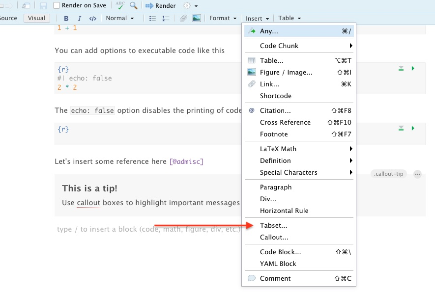
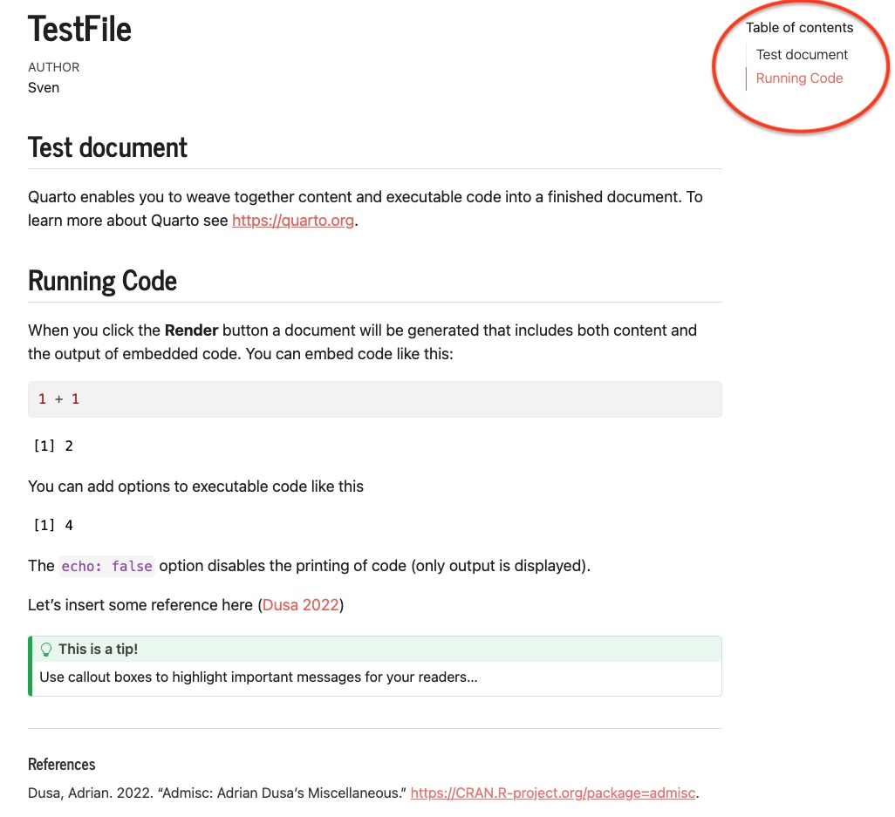

class: title-slide, center, middle

<link rel="stylesheet" href="https://use.fontawesome.com/releases/v5.6.0/css/all.css" integrity="sha384-aOkxzJ5uQz7WBObEZcHvV5JvRW3TUc2rNPA7pe3AwnsUohiw1Vj2Rgx2KSOkF5+h" crossorigin="anonymous">


```{r setup, echo = FALSE, message = FALSE, waning = FALSE, error = FALSE}
knitr::opts_chunk$set(fig.retina = 3, warning = FALSE, message = FALSE)
extrafont::loadfonts()
```

<style>

.center2 {
  margin: 0;
  position: absolute;
  top: 50%;
  left: 50%;
  -ms-transform: translate(-50%, -50%);
  transform: translate(-50%, -50%);
}

.rcorners1 {
  margin: auto;
  border-radius: 25px;
  background: #ada500;
  padding: 10px;
#  width: 50%;
}
</style>

```{css echo=FALSE}
.right-column{
  padding-top: 0;
}

.remark-code, .remark-inline-code { font-family: 'Source Code Pro', 'Lucida Console', Monaco, monospace;
                                    font-size: 90%;
                                  }

```


<div class="my-logo-left">  </div>
<div class="my-logo-right">  </div>


# ICO Workshop R & RStudio
.font160[
.SW-greenD[Part 2]
]
.font120[
.SW-greenD[*Markdown* & *Quarto*]
]
Sven De Maeyer & Tine van Daal

.font80[
.UA-red[
2nd - 4th July, 2024
]
]

---
class: inverse-green, left

# Overview

.center2[
- What is markdown --- ([Go to that section](#part1))
- Integrating Markdown and R code --- ([Go to that section](#part2))
- Creating a basic Quarto document --- ([Go to that section](#part3))

]

---
class: inverse-green, center, middle
name: part1

# 1. What is markdown?

---

## Markdown

- 'low end' text editor system

- make content that can be read on different systems

- mainly easy way to generate **html** files

- you write in 'plain text' and an interpreter generates an nice edited version

---

## Basic syntax

```{r, out.height = "55%", out.width="55%", eval = T, echo = F}

```

---

## Extension

```{r, out.height = "55%", out.width="55%", eval = T, echo = F, fig.cap = "extended lijst van commando's"}

```

---
class: inverse-green, center, middle
name: part2

# 2. Integrating Markdown and R code

---

## Rmarkdown & Quarto

Two roads with the same destination, but...

.pull-left[

.UA-red[Rmarkdown]

- developed 10 years ago by RStudio company
- an R package
- only works in RStudio
- still supported but no major advances in development
- generates pdf, html and word-docs

]

.pull-right[

.UA-red[Quarto]

- recently developed by RStudio company
- stand alone software
- integrates with RStudio but also with other software
- cross-language platform (python, Julia, Observable, ...)
- all new cool new stuff will be implemented in Quarto
- generates pdf, html, word, open-office, ppt, ePub, Observable JS, Jira Wiki, websites, online books, etc
- CEO of RStudio company anounced the development of an online editing application (like google docs)

]

---

## How Quarto works...

.center2[
```{r, out.height = "80%", out.width="80%", eval = T, echo = F}

```
]
---
## Quarto info

If you want to learn more about Quarto, a lot of information is available at  

https://quarto.org/docs/guide/

<br>

AND 

<br>

there are great extensions!

see: https://quarto.org/docs/extensions/

---
## Installing Quarto

```{r, out.height = "60%", out.width="60%", eval = T, echo = F}

```

.UA-red[**Click on GET STARTED**]
---
## Installing Quarto

```{r, out.height = "60%", out.width="60%", eval = T, echo = F}

```

.UA-red[**Choose the correct version for your pc**]

.UA-red[**Install the software and restart RStudio**]

---
## Check the installation

.UA-red[**You should see the option to open a new "Quarto document" in RStudio**]

---
class: inverse-green, center, middle
name: part3

# 3. Creating a basic Quarto document
---

## A first basic hands-on exploration of Quarto

.center2[
.rcorners1[.Large[
<i class="fas fa-code" style="color: #FF0035;"></i> .white[*Let's create a first Quarto Document...*]
]
<br> 
.footnotesize[.white[   *The following slides are some screen shots of what we all did together, hands-on*  😊 
]]
]
]

---
## Open a New File

.pull-left[

- Click on .UA-red[**File**]
- Choose .UA-red[**New File**]
- Choose .UA-red[**Quarto Document...**]

]

.pull-right[
Result:
```{r, out.height = "100%", out.width="100%", eval = T, echo = F}

```
]


---
## Fill in some basic info

.pull-left[

- Fill in a .UA-red[**title**] and an .UA-red[**author**]
- Click on .UA-red[**Create**]

]

.pull-right[
Result:
```{r, out.height = "100%", out.width="100%", eval = T, echo = F}

```
]

---
## Two different views

.pull-left[

.UA-red[**Source editor**]
```{r, out.height = "90%", out.width="90%", eval = T, echo = F}

```

= raw 'markdown' language
]

.pull-right[

.UA-red[**Visual editor**]
```{r, out.height = "90%", out.width="90%", eval = T, echo = F}

```

= like a worddoc editor (see what you get)
]

---
## Two parts of a Quarto document

.pull-left[
.SW-greenD[
YAML
]

```{r, out.height = "100%", out.width="100%", eval = T, echo = F}

```

To set some of the parameters (aka **Metadata**)
]

.pull-right[
.SW-greenD[
Your narrative:
]

Titles +

text +

code +

output +

tables + 

figures (generated by code) +

images +

(exeternal and internal) links +

references +

embeded content (e.g., YouTube Video)

etc.
]

---
## Code chunks 

All R-code can be written in .UA-red[**Code chunks**]

While constructing your Quarto document you can RUN code chunks 

Click the green arrow (top-right corner of code chunk) 

```{r, out.height = "100%", out.width="100%", eval = T, echo = F}

```

As a result you get the output printed in your Quarto document

```{r, out.height = "100%", out.width="100%", eval = T, echo = F}

```

---
## Code chunks 

.UA-red[**ATTENTION!**]: The order of code chunks do matter. If you want to run all the code in the code chunks before a certain code chunk, you can click on the button aside of the green arrow (downward green arrow)

---
## Adding a new code chunk 

.pull-left[
```{r, out.height = "80%", out.width="80%", eval = T, echo = F}

```
]

.pull-right[
```{r, out.height = "80%", out.width="80%", eval = T, echo = F}

```
]

.center2[
<br>
<br>
<br>
  <p style=" text-align:center;">
  .Large[<i class="fas fa-arrow-circle-right" style="color: #FF0035;"></i>] 
  </p>
<br> <br> <br> <br> <br> <br>
Or with a short-cut (on your keyboard)...

Windows: .UA-red[**`ctrl + alt + i`**]

Mac: .UA-red[**`option + command + i`**]
]

---
## Code chunk options

```{r, out.height = "80%", out.width="80%", eval = T, echo = F}

```

- `#| include: false` $/rightarrow$ code and output (result) are hidden but code is executed

- `#| echo: false`: only results are printed, code is hidden

- `#| message: false` hides messages coming from R related to running the code

- `#| warning: false` hides warnings coming from running the code

- `#| error: false` hides error messages coming rom running the code

- `#| fig.cap = "..."` adds a caption for a figure created

More detailed information: https://yihui.org/knitr/options/ 
---
## Inserting references

You can easily insert citations and references

.pull-left[
```{r, out.height = "80%", out.width="80%", eval = T, echo = F}

```
]

.pull-right[
```{r, out.height = "80%", out.width="80%", eval = T, echo = F}

```
]

---
## Inserting references

If you work with .UA-red[Zotero] there is an easy integration! (https://www.zotero.org/)

Search references based on DOI

Easy to find and insert citations of R packages installed on your computer

---
## Inserting a callout

To highlight some specific piece of text you can use a callout

It will generate something like this in your final html document:

```{r, out.height = "80%", out.width="80%", eval = T, echo = F}

```

---
## Inserting a callout

.pull-left[
```{r, out.height = "80%", out.width="80%", eval = T, echo = F}

```
]

.pull-right[
```{r, out.height = "80%", out.width="80%", eval = T, echo = F}

```
]

---
## Adding a Tabset

In an html file you can also add Tabsets... They look like this in the resulting html file:

.pull-left[
```{r, out.height = "100%", out.width="100%", eval = T, echo = F}

```

]

.pull-right[
```{r, out.height = "100%", out.width="100%", eval = T, echo = F}

```
]

This is a way to save space on the canvas and keep your file tight and neat. 
---
## Adding a Tabset

Go to .UA-red[**Insert**] and choose .UA-red[**Tabset**]

```{r, out.height = "60%", out.width="60%", eval = T, echo = F}

```

---
## Adding a Tabset

.pull-left[

This opens the following menu:

```{r, out.height = "60%", out.width="60%", eval = T, echo = F}

```


]

.pull-right[

You can fill in the titles for each tab in the Tabset:

```{r, out.height = "60%", out.width="60%", eval = T, echo = F}

```


]

---
## Adding a Tabset

In the Quarto document you now have a section to make content for each tab in the Tabset:

```{r, out.height = "60%", out.width="60%", eval = T, echo = F}

```


---
## Changing your theme

If you don't like the formatting of the rendered html file, there are some other themes that can be used!

See: https://quarto.org/docs/output-formats/html-themes.html

This is something you can tweak in the YAML of the file

For instance, let's choose the formatting according to the `journal` theme

```{r, out.height = "80%", out.width="80%", eval = T, echo = F}

```

---
## Changing your theme

.pull-left[

Let's try another one: `superhero`! 

This one is clearly different from the default theme.

Of course, if you feel adventurous you can build your own theme (e.g., to meet the branding of your university)

]


.pull-right[

```{r, out.height = "100%", out.width="100%", eval = T, echo = F}

```

]

---
## Tweaking your theme in the YAML

Some elements of formatting can be easily added in the YAML

See https://quarto.org/docs/output-formats/html-basics.html

.pull-left[

For instance, let's also add a *table of contents* (toc) that contains all headers up till level 3

```{r, out.height = "100%", out.width="100%", eval = T, echo = F}

```


]

.pull-right[

```{r, out.height = "100%", out.width="100%", eval = T, echo = F}

```

]

---
## Code folding

By default all the code is shown for code chunks that have not set the option `#| echo: false`

This behaviour can be changed in the YAML by introducing the `code-fold: true` option

.pull-left[

```{r, out.height = "100%", out.width="100%", eval = T, echo = F}

```

]


.pull-right[

```{r, out.height = "100%", out.width="100%", eval = T, echo = F}

```

]


