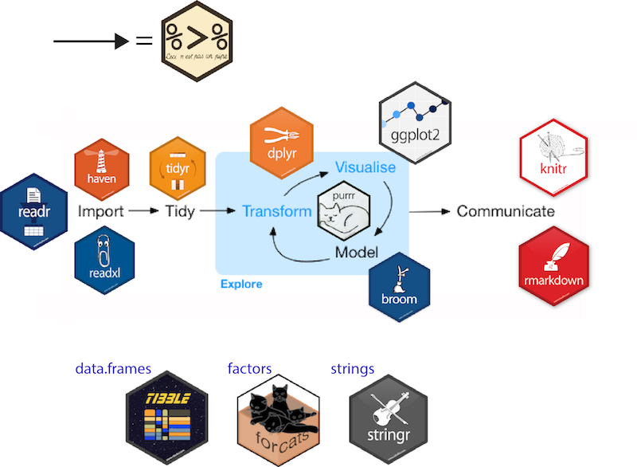

class: title-slide, center, middle

<link rel="stylesheet" href="https://use.fontawesome.com/releases/v5.6.0/css/all.css" integrity="sha384-aOkxzJ5uQz7WBObEZcHvV5JvRW3TUc2rNPA7pe3AwnsUohiw1Vj2Rgx2KSOkF5+h" crossorigin="anonymous">


```{r setup, echo = FALSE, message = FALSE, waning = FALSE, error = FALSE}
knitr::opts_chunk$set(fig.retina = 3, warning = FALSE, message = FALSE)
extrafont::loadfonts()
```

<style>

.center2 {
  margin: 0;
  position: absolute;
  top: 50%;
  left: 50%;
  -ms-transform: translate(-50%, -50%);
  transform: translate(-50%, -50%);
}

.rcorners1 {
  margin: auto;
  border-radius: 25px;
  background: #ada500;
  padding: 10px;
#  width: 50%;
}
</style>

```{css echo=FALSE}
.right-column{
  padding-top: 0;
}

.remark-code, .remark-inline-code { font-family: 'Source Code Pro', 'Lucida Console', Monaco, monospace;
                                    font-size: 90%;
                                  }

```


<div class="my-logo-left">  </div>
<div class="my-logo-right">  </div>


# ICO Workshop R & RStudio
.font160[
.SW-greenD[Part 3]
]
.font120[
.SW-greenD[*Data manipulation with*] .UA-red[*`dplyr`*]
]
Sven De Maeyer & Tine van Daal

.font80[
.UA-red[
2nd - 4th July, 2024
]
]

---
class: inverse-green, left

# Overview

.center2[
- Tidyverse --- ([Click here](#part1))
- The `dplyr` package --- ([Cliick here](#part2))
- Implementation --- ([Click here](#part3))

]

---
class: inverse-green, center, middle
name: part1

# 1. Tidyverse

---

## Welcom in the .UA-red[`tidyverse`]

.center2[
```{r, out.height = "100%", out.width="100%", eval = T, echo = F}

```
]

---

## Why .UA-red[`tidyverse`]?

- more accessible for beginners

- consistent approach for all potential tasks

- powerful potential applications mith minimum 'effort'

- can give confidence to explore `R`
---
## Tibble

Normally we work with a  .SW-greenD[dataframe] in `R` but we can have very complex data-structures as well (e.g., lists, matrices, ...)

In the `tidyverse` ecosystem we work with a simple form of data-structure: a `tibble`

A tibble is a dataframe that fits the **tidy data** principle

.footnotesize[
```{r, include = FALSE}
library(here)
library(tidyverse)
library(foreign)
Friends <- read.spss(
   file = here("Exercises", "Data", "Friends.sav"),
   use.value.labels = F,
   to.data.frame = T
 )
Friends <- tibble(Friends)
```

```{r}
Friends
```

]

---
## What is **tidy data**?

```{r, out.height = "80%", out.width="80%", eval = T, echo = F}
knitr::include_graphics("tidydata_1.jpeg")
```

<p align="right">.footnotesize[.SW-greenD[*Artwork by @allison_horst*]] </p>

---
## What is **tidy data**?

```{r, out.height = "80%", out.width="80%", eval = T, echo = F}
knitr::include_graphics("tidydata_2.jpeg")
```

<p align="right">.footnotesize[.SW-greenD[*Artwork by @allison_horst*]] </p>

---
## What is **tidy data**?

```{r, out.height = "80%", out.width="80%", eval = T, echo = F}
knitr::include_graphics("tidydata_3.jpeg")
```

<p align="right">.footnotesize[.SW-greenD[*Artwork by @allison_horst*]] </p>

---
class: inverse-green, center, middle
name: part2

# 2. The .UA-red[`dplyr`] package

---

## .UA-red[`dplyr`] ...

.Large[is THE package to work with tidy data !]

<br>
<br>

.SW-greenD[**VERBS**] are at the core:

- `filter()`
- `mutate()`
- `select()`
- `group_by() + summarise()`
- `arrange()`
- `rename()`
- `relocate()`
- `join()`

---

```{r, out.height = "60%", out.width="60%", eval = T, echo = F}

```

https://raw.githubusercontent.com/rstudio/cheatsheets/master/data-transformation.pdf
---

## The .UA-red[`%>%`] operator (a 'pipe')
.left-column[
```{r, out.height = "100%", out.width="100%", eval = T, echo = F}

```
<br>
<p align="center">To create <br>.SW-greenD[**a chain of functions**] </p>

]

.right-column[

Instead of

```{r, eval = FALSE}
mean(c(1,2,3,4))
```

or

```{r, eval = FALSE}
Numbers <- c(1,2,3,4)
mean(Numbers)
```

you can do

```{r, eval = FALSE}
c(1,2,3,4) %>% 
  mean( )
```

With the `%>%` you can write a sentence like:

> *I .UA-red[`%>%`] woke up .UA-red[`%>%`], took a shower .UA-red[`%>%`], got breakfast .UA-red[`%>%`], took the train .UA-red[`%>%`] and arrived at the ICO course .UA-red[`%>%`] …*
]

---

## .UA-red[`filter()`]

```{r, out.height = "70%", out.width="70%", eval = T, echo = F}
knitr::include_graphics("dplyr_filter.jpeg")
```

<p align="right">.footnotesize[.SW-greenD[*Artwork by @allison_horst*]] </p>

---
## Let's apply .UA-red[`filter()`]

With the FRIENDS data:

> .SW-greenD[*We only select observations from the first measurement occassion in condition 1*]

```{r, eval = FALSE, echo = TRUE}
Friends_Occ1 <- Friends %>%
  filter(occassion == 1 & condition == 1)
```

.UA-red[`==`] is *equals* (notice the 2 = signs!)


> .SW-greenD[*Let's clean some data, and remove observations with fluency values above 300 and that do not equal fluence value 0*]

```{r, eval = FALSE, echo = TRUE}
Friends_clean <- Friends %>%
  filter(fluency < 300 & fluency != 0)
```

.UA-red[`!=`] means *not equal to*

---
## .UA-red[`mutate()`]

```{r, out.height = "50%", out.width="50%", eval = T, echo = F}
knitr::include_graphics("dplyr_mutate.png")
```

<p align="right">.footnotesize[.SW-greenD[*Artwork by @allison_horst*]] </p>

---
## Let's apply .UA-red[`mutate()`] 

With the Friends data:

> .SW-greenD[*We calculate a new variable containing the fluency scores minus the average of fluency*]

```{r, eval = FALSE, echo = TRUE}
Friends <- Friends %>%
  mutate(
    fluency_centered = fluency - mean(fluency, na.rm = T)
    )
```

---

## Let's apply .UA-red[`mutate()`]

With the Friends data:

> .SW-greenD[*We create a factor for condition*]

```{r, eval = TRUE, echo = TRUE}
Friends <- Friends %>%
  mutate(
    condition_factor = as.factor(condition)
  )

str(Friends$condition_factor)
```

---
## Let's apply .UA-red[`select()`]

To select variables.

Some examples with the Friends data:

> .SW-greenD[*We only select `condition` and `occasion` and inspect the result with the `str()`function*]

.footnotesize[
```{r, eval = TRUE, echo = TRUE}
Friends %>%
  select(
    condition, occassion
  ) %>%
  str()
```
]
---
## Rename variables with .UA-red[`rename()`]

Notice how the variable `occassion` is misspelled! Pretty enoying when coding... But we can easily rename variables.

Function `rename(new_name = old_name)`

> .SW-greenD[*Rename the variable `occassion` to `occasion`* ]

.footnotesize[
```{r, eval = TRUE, echo = TRUE}
Friends <- Friends %>%
  rename(
    occasion = occassion
  )
```
]

---
## Super combo 1: .UA-red[`group_by() + summarize( )`] 

- transform a tibble to a *grouped tibble* making use of `group_by()` 

- calculate summary stats per group making use of `summarize()`

> .SW-greenD[*Calculate the average fluency and standard deviation per condition* ]

.footnotesize[
```{r, eval = TRUE, echo = TRUE}
Friends %>%
  group_by(
    condition
  ) %>%
  summarize(
    mean_fluency = mean(fluency),
    sd_fluency   = sd(fluency)
  )
```
]

---
## Super combo 1: .UA-red[`group_by() + summarize( )`] 

> .SW-greenD[*Calculate the number of observations for each combination of condition and occasion* ]

.footnotesize[
```{r, eval = TRUE, echo = TRUE}
Friends %>%
  group_by(
    occasion, condition
  ) %>%
  summarize(
    n_observations  = n()
  )
```
]

---
## Super combo 2: .UA-red[`mutate() + case_when( )`] 

```{r, out.height = "70%", out.width="70%", eval = T, echo = F}
knitr::include_graphics("dplyr_case_when_sm.png")
```

<p align="right">.footnotesize[.SW-greenD[*Artwork by @allison_horst*]] </p>

---
## Super combo 2: .UA-red[`mutate() + case_when( )`] 

To recode variables into new variables!

.pull-left[
> .SW-greenD[*We create a new categorical variant of fluency with 3 groups, then we select this new variable and have a look to the top 5 observations...* ]]

.pull-right[
.footnotesize[
```{r eval = TRUE, echo = TRUE}
Friends %>%
  mutate(
    fluency_grouped = case_when(
      fluency < 106.625 - 7.1 ~ 'low',
      fluency >= 106.625 - 7.1 & fluency < 106.625 + 7.1 ~ 'average',
      fluency >= 106.625 + 7.1 ~ 'high'
    )
  ) %>% 
  select(
    fluency,
    fluency_grouped
    ) %>%
  head(5)
```
]
]

---

## How to define conditions

- .UA-red[`x == y`] $\rightarrow$ 'x is equal to y'

- .UA-red[`x != y` ] $\rightarrow$ 'x is NOT equal to y'

- .UA-red[`x < y`] $\rightarrow$ 'x is smaller than y'

- .UA-red[`x <= y`] $\rightarrow$ 'x is smaller or equal to y'

- .UA-red[`x > y`] $\rightarrow$ 'x is higher than y'

- .UA-red[`x >= y`] $\rightarrow$ 'x is higher or equal to y'

---

## Bolean operators

We can combine conditions!

- .UA-red[`&`] $\rightarrow$ 'and' $\rightarrow$ example: `gender == 1 & age <=18`

- .UA-red[`|`] $\rightarrow$ 'or' $\rightarrow$ example: `gender == 1 | gender == 2`

- .UA-red[`!`] $\rightarrow$ 'not' $\rightarrow$ example: `gender == 1 & !age <=18`

---

## Interactive tutorial about .UA-red[`dplyr()`]

If you want some more material and a place to exercise your skills? This online and freetutorial (made with the package  `learnr`) is strongly advised!

```{r, out.height = "50%", out.width="50%", eval = T, echo = F}
knitr::include_graphics("Interactive_tutorial_dplyr.jpg")
```

https://allisonhorst.shinyapps.io/dplyr-learnr/#section-welcome


---
class: inverse-blue

# <i class="fas fa-laptop-code" style="color: #FF0035;"></i> Exercise `dplyr`

.left-column[

]
.right-column[
- You can find the qmd-file .SW-greenD[ `Exercises_dplyr.qmd`] on the Open Science Framework (Exercises > Exercise2_dplyr)

- Open this document in an R project for the Exercises folder

- You get a set of tasks with empty code blocks to start coding

- Write and test the necessary code

- Stuck? No Worries! 
  - We are there
  - Help each other
  - There is a solution key (.SW-greenD[`Exercises_dplyr_solutions.qmd`]) 

]