class: title-slide, center, middle

<link rel="stylesheet" href="https://use.fontawesome.com/releases/v5.6.0/css/all.css" integrity="sha384-aOkxzJ5uQz7WBObEZcHvV5JvRW3TUc2rNPA7pe3AwnsUohiw1Vj2Rgx2KSOkF5+h" crossorigin="anonymous">


```{r setup, echo = FALSE, message = FALSE, waning = FALSE, error = FALSE, include=FALSE}
knitr::opts_chunk$set(fig.retina = 3, warning = FALSE, message = FALSE)
extrafont::loadfonts()
library(readxl)
library(tidyverse)
library(patchwork)
library(haven)
library(here)

Friends <- read_sav(here("Project_Friends_DUMMY", "Data", "Friends.sav"))

Friends <- Friends %>%
  mutate_at(vars(fluency, occassion), as.numeric) %>%
  mutate_at(vars(condition, student), factor)

library(palmerpenguins)
data("penguins")
```

<style>

.center2 {
  margin: 0;
  position: absolute;
  top: 50%;
  left: 50%;
  -ms-transform: translate(-50%, -50%);
  transform: translate(-50%, -50%);
}

.rcorners1 {
  margin: auto;
  border-radius: 25px;
  background: #ada500;
  padding: 10px;
#  width: 50%;
}
</style>

```{css echo=FALSE}
.right-column{
  padding-top: 0;
}

.remark-code, .remark-inline-code { font-family: 'Source Code Pro', 'Lucida Console', Monaco, monospace;
                                    font-size: 90%;
                                  }

```


<div class="my-logo-left">  </div>
<div class="my-logo-right">  </div>


# ICO Workshop R & RStudio
.font160[
.SW-greenD[Part 4]
]
.font120[
.SW-greenD[*Powerful visualisations with*] .UA-red[*`ggplot2`*]
]
Sven De Maeyer & Tine van Daal

.font80[
.UA-red[
2nd - 4th July, 2024
]
]

---
class: inverse-green, left

# Overview

.center2[
1. Simple plots in R --- ([click here](#part1))
2. Grammar of graphics --- ([click here](#part2))
3. How `ggplot2` works (in a nutshell) --- ([click here](#part3))
4. Visualising a categorical variable --- ([click here](#part4))
5. Visualising a quantitative variable --- ([click here](#part5))
6. Visualising more than one variable --- ([click here](#part6))
7. More about visualisation? --- ([click here](#part7))
]

---
class: inverse-green, center, middle
name: part1

# 1. Simple plots in R

---

## Plots in .UA-red[`base`] 

```{r xaringan-panelset, echo=FALSE}
xaringanExtra::use_panelset()
xaringanExtra::style_panelset_tabs(
  active_foreground = "#AAAA17",
  hover_foreground = "#d22",
  font_family = "Roboto"
)
```

.panelset[
.panel[.panel-name[.SW-greenD[`plot()`]]
.SW_greenD[The generic function .UA-red[`plot()`] "knows" what to do (plot) with the input it receives.]
.pull-left[
```{r eval = T, echo = T, fig.width = 3.5, fig.height=3.5, fig.align = "center"}
# one quantitatieve variable
plot(Friends$fluency)
```
]
.pull-right[
```{r eval = T, echo = T, fig.width = 3.5, fig.height=3.5, fig.align = "center"}
# one qualitative variables
plot(table(Friends$condition))
```
]
]
.panel[.panel-name[`boxplot()`]
```{r eval = T, echo = T, fig.width = 5, fig.height=5, fig.align = 'center'}
boxplot(
  Friends$fluency,
  main = "Boxplot of the variable 'fluency'", 
  col = "steelblue"
  ) 
```
]
.panel[.panel-name[`hist()`]
```{r eval = T, echo = T, fig.width = 4, fig.height=4, fig.align = 'center'}
hist(
  Friends$fluency,
  main = "Histogram of the variable 'fluency'",
  freq = FALSE,
  ylim = c(0, .08)
  ) 
```
]
]

---
class: inverse-green, center, middle
name: part2

# 2. Grammar of Graphics

---

## A more theoretical approach to visualisation

.left-column[
```{r, out.height = "80%", out.width="80%", eval = T, echo = F}
knitr::include_graphics("img/Grammar_of_Graphics_cover.jpeg")
```
]

.right-column[
- Theoretical 'breakdown' of a visualisation into components (called layers)

- One system to create different visualisations

- At the heart of several modern graphical applications:
  - ggplot2
  - Tableau (Polaris)
  - Vega-Lite
]
<br>
.footnote[
_Slide taken from slide show by [Thomas Lin Pedersen](https://github.com/thomasp85/ggplot2_workshop/blob/master/presentation.pdf)_]


---

## Key idea behind the Grammar of Graphics

.pull-left[
.font140[**Layers** of a visualisation:]  
  .data-theme[.bold[data]]  
  .aes-theme[.bold[aesthetics]]  
  .geom-theme[.bold[geometries]]  
  .facet-theme[.bold[facets]]  
  .stat-theme[.bold[statistics]]  
  .coord-theme[.bold[coordinates]]  
  .theme-theme[.bold[themes]]  
]

.pull-right[

]
<br>  
<br>  
<br>  
.footnote[
_Animation by [Thomas de Beus](https://medium.com/tdebeus/think-about-the-grammar-of-graphics-when-improving-your-graphs-18e3744d8d18)_]

---

## Grammar of Graphics is a bit like cake 
.pull-left[
<br>   
<br>    
Start by setting up the *foundation* with **`ggplot()`**  

Specify *ingredients* (variables) with **`aes()`** and a *flavour* with  **`scales`** 

Create *layers* to plot with **`geoms`**  

*Style* the cake with **`theme`**  
]

.pull-right[
```{r, out.height = "70%", out.width="70%", eval = T, echo = F}
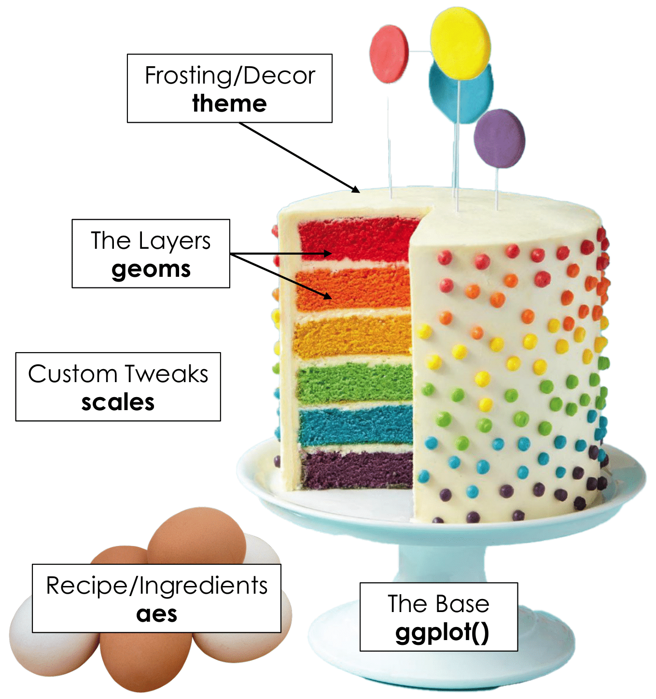
```
]
.footnote[
_Slide by [Tanya Shapiro](https://twitter.com/tanya_shapiro/status/1576935152575340544?s=20&t=IDPBrEMzKw8NNxA9TW2F4A)_]

---
<div class="my-logo-right">  </div>

## Grammar of Graphics: .data-theme[data]

- Data is not only raw data, but can also be the results from an analysis
  
```{r, echo = F}
library(kableExtra)
Data <- tibble(
  group = c("BE Male", "BE Female", "BE Other", "NL Male", "NL Female", "NL Other"),
  country = c("BE", "BE", "BE", "NL", "NL", "NL"),
  gender = c("Male", "Female", "Other", "Male", "Female", "Other"),
  mean_age = c(39, 41, 36, 37, 36, 31),
  SD_age = c(11, 13.2, 8.2, 12, 14, 7.2)
) %>%
  mutate(
    CI_lower = round(mean_age - (1.96*SD_age),2),
    CI_upper = round(mean_age + (1.96*SD_age),2)
  )

kableExtra::kable(Data)
```

<br>  

- Data has to be 'tidy'

---
<div class="my-logo-right">  </div>

## Grammar of Graphics: .aes-theme[aesthetics]

.pull-left[
- Describe how variables in data are *mapped* to visual properties. For example: 
  - variables mapped on x- and y-axis
  - variable that defines color or size of points
  - ...
  
- Change appearances of aesthetics using `scales`  
]
.pull-right[
```{r, eval = T, echo=F, fig.width = 10, fig.height=6, fig.align="center"}
plot <- 
  Friends %>% 
  ggplot(aes(x = fluency,          # maps variable 'fluency' to x-axis
             fill = condition)) +     # variable 'condition' defines color
  geom_density(alpha = .6) +
  ggtitle("Three aesthetics mapped: x-axis, y-axis and fill") +
  theme_minimal() +
  theme(plot.title = element_text(face = "bold", size = 20),
        axis.title = element_text(face = "bold", size = 14),
        legend.title = element_text(face = "bold", size = 14))
plot
```
]

---
<div class="my-logo-right">  </div>

## Grammar of Graphics: .geom-theme[geometries]

.pull-left[
- Geometrical shapes at the heart of visualisation. For example:
  - boxplot
  - line
  - ...
]

.pull-right[
```{r, eval = T, echo=F, fig.width = 10, fig.height=6, fig.align="center"}
plot1 <- 
  Friends %>% 
  ggplot(aes(x = fluency,          # maps variable 'fluency' to x-axis
             fill = condition)) +  # variable 'condition' defines color
  geom_density(alpha = .6) +
  ggtitle("Geometry used: 'geom_density'") +
  theme_minimal() +
  theme(plot.title = element_text(face = "bold", size = 18),
        axis.title = element_text(face = "bold", size = 14),
        legend.position = "none")
plot2 <- 
  Friends %>% 
  ggplot(aes(x = fluency,          # maps variable 'fluency' to x-axis
             fill = condition)) +  # variable 'condition' defines color
  geom_histogram(alpha = .6) +
  ggtitle("Geometry used: 'geom_histogram'") +
  theme_minimal() +
  theme(plot.title = element_text(face = "bold", size = 18),
        axis.title.x = element_text(face = "bold", size = 14),
        axis.title.y = element_blank(),
        legend.title = element_text(face = "bold", size = 14))
plot1 + plot_spacer() + plot2 +
  plot_layout(widths = c(1, .1, 1), ncol = 3)
```
]
---
<div class="my-logo-right">  </div>

## Grammar of Graphics: .facet-theme[facets]

.pull-left[
- Also called 'small multiples'  

- Define how much panels are shown and how they are arranged
]
.pull-right[
```{r, eval = T, echo=F, fig.width = 10, fig.height=6, fig.align="center"}
plot <- 
  Friends %>% 
  mutate(condition = factor(condition,
                            levels = c(1:3),
                            labels = c("English subtitles",
                                       "Spanish subtitles",
                                       "No subtitles"))) %>%
  ggplot(aes(x = fluency,          # maps variable 'fluency' to x-axis
             fill = condition)) +  # variable 'condition' defines color
  geom_density(alpha = .6) +
  ggtitle("Faceted by variable 'condition' (all facets on 1 row)") +
  facet_wrap(~condition) +
  theme_minimal() +
  theme(plot.title = element_text(face = "bold", size = 20),
        axis.title = element_text(size = 14),
        legend.title = element_text(size = 14),
        strip.text = element_text(face = "bold", size = 14))
plot
```

]

---
<div class="my-logo-right">  </div>

## Grammar of Graphics: .stat-theme[statistics]

.pull-left[
- Data might be `tidy`, but still in need of some statistical calculations. For example: 
  - Calculate descriptive statistics to create a boxplot
  - Estimate a linear (or other) model to draw a regression line in a scatter plot

- Often implicit done by `ggplot2`
]
.pull-right[
```{r, eval = T, echo=F, fig.width = 10, fig.height=6, fig.align="center"}
plot <- 
  Friends %>% 
  mutate(condition = factor(condition,
                            levels = c(1:3),
                            labels = c("English subtitles",
                                       "Spanish subtitles",
                                       "No subtitles"))) %>%
  ggplot(aes(x = fluency,          # maps variable 'fluency' to x-axis
             fill = condition)) +  # variable 'condition' defines color
  geom_boxplot(alpha = .6) +
  ggtitle("'geom_boxplot()' computes the necessary statistics in the background") +
  theme_minimal() +
  theme(plot.title = element_text(face = "bold", size = 20),
        axis.title = element_text(size = 14),
        legend.title = element_text(size = 14))
plot
```
]

---
class: inverse-green, center, middle
name: part3

# 3. How `ggplot2` works (in a nutshell)

---
<div class="my-logo-right">  </div>

## Time to get the penguins in...

Nice data set that can be used within R 
.font60[(Source: https://allisonhorst.github.io/palmerpenguins/articles/intro.html)]

```{r, eval = FALSE}
install.packages("palmerpenguins")
library(palmerpenguins)
data("penguins")
```

```{r, out.height = "50%", out.width="50%", eval = T, echo = F}
knitr::include_graphics("img/lter_penguins.png")
```

<p align="right">.footnotesize[.SW-greenD[*Artwork by @allison_horst*]] </p>

---
<div class="my-logo-right">  </div>

## Time to get the penguins in...

```{r, echo = FALSE}
kable((penguins[sample(1:300,10),]),
      caption = "Table 1. Random sample of 10 observations from the Palmer Pinguins dataset")
```

---

## The basics of .UA-red[`ggplot2`]: *data & aesthetics*

.pull-left[
```{r, eval = FALSE}
Plot <- ggplot(

  ## Step 1: data
  data = penguins,
  
  ## Step 2: specify aesthetics (mapping)
  aes(
    x = flipper_length_mm,
    y = body_mass_g)
)

Plot
```
]

.pull-right[
```{r, echo = FALSE, fig.width = 5, fig.height = 5, fig.align = "center"}
Plot <- ggplot(

  ## Step 1: data
  data = penguins,
  
  ## Step 2: specify aesthetics (mapping)
  aes(
    x = flipper_length_mm,
    y = body_mass_g)
)

Plot
```
]

---

## The basics of .UA-red[`ggplot2`]: *geometry*

.pull-left[
```{r, eval = FALSE}
Plot <- ggplot(

  ## Step 1: data
  data = penguins,
  
  ## Step 2: specify aesthetics (mapping)
  aes(
    x = flipper_length_mm,
    y = body_mass_g)
) +
  ## Step 3: add geometry
  geom_point()


Plot
```
]

.pull-right[
```{r, echo = FALSE, fig.width = 5, fig.height = 5, fig.align = "center"}
Plot <- ggplot(

  ## Step 1: data
  data = penguins,
  
  ## Step 2: specify aesthetics (mapping)
  aes(
    x = flipper_length_mm,
    y = body_mass_g)
) +
  ## Step 3: add geometry
  geom_point()

Plot
```
]

Not every component of the *Grammar of Graphics* needs to be defined. The other components have *default* values that are automatically applied.

---

## The basics of .UA-red[`ggplot2`]: *facets*

.pull-left[
```{r, eval = FALSE}
Plot <- ggplot(

  ## Step 1: data
  data = penguins,
  
  ## Step 2: specify aesthetics (mapping)
  aes(
    x = flipper_length_mm,
    y = body_mass_g)
) +
  ## Step 3: add geometry
  geom_point() +
  
  ## Step 4: define facets
  facet_wrap(~species)


Plot
```
]

.pull-right[
```{r, echo = FALSE, fig.width = 5, fig.height = 5, fig.align = "center"}
Plot <- ggplot(

  ## Step 1: data
  data = penguins,
  
  ## Step 2: specify aesthetics (mapping)
  aes(
    x = flipper_length_mm,
    y = body_mass_g)
) +
  ## Step 3: add geometry
  geom_point() +
  
  ## Step 4: define facets
  facet_wrap(~species)

Plot
```
]

---

## The basics of .UA-red[`ggplot2`]: *theme*

.pull-left[
```{r, eval = FALSE}
Plot <- ggplot(

  ## Step 1: data
  data = penguins,
  
  ## Step 2: specify aesthetics (mapping)
  aes(
    x = flipper_length_mm,
    y = body_mass_g)
) +
  ## Step 3: add geometry
  geom_point() +
  
  ## Step 4: define facets 
  facet_wrap(~species) +
  
  ## Step 5: set theme
  theme_minimal()


Plot
```
]

.pull-right[
```{r, echo = FALSE, fig.width = 5, fig.height = 5, fig.align = "center"}
Plot <- ggplot(

  ## Step 1: data
  data = penguins,
  
  ## Step 2: specify aesthetics (mapping)
  aes(
    x = flipper_length_mm,
    y = body_mass_g)
) +
  ## Step 3: add geometry
  geom_point() +
  
  ## Step 4: define facets
  facet_wrap(~species) +
  
  ## Step 5: set theme
  theme_minimal()

Plot
```
]

---

## Building a visualisation by adding layers ...

```{r, echo = FALSE, fig.align = "center", fig.width= 16, fig.height = 8}

P1 <- penguins %>%
  filter(!is.na(sex)) %>%
  ggplot(aes(flipper_length_mm, body_mass_g ))

P2 <- P1 + 
  geom_point()

P3 <- P2 +
  geom_point(
    aes(color = sex, shape = sex), 
    alpha = .8, size = 3) +
  scale_color_manual(values = c("darkorange","purple","cyan4"))

P4 <- P3 +
  geom_smooth(method = "lm")

P5 <- P3 +
  geom_smooth(
    aes(color = sex),
    se = F,
    method = "lm") 

P6 <- P5 +
  scale_x_continuous("Flipper length (mm)") +
  scale_y_continuous("Body Mass (g)")

P7 <- P6 + theme_minimal()

P8 <- P7 +
  labs(title = "Palmer penguins",
       subtitle = "Flipper length and body mass for both sexes")

P1 + P2 + P3 + P4 + P5 + P6 + P7 + P8 + patchwork::plot_layout(ncol = 4)

```

---

## Several .UA-red[`geom_*`] options...

```{r, out.height = "60%", out.width="60%", eval = T, echo = F, fig.align="center"}
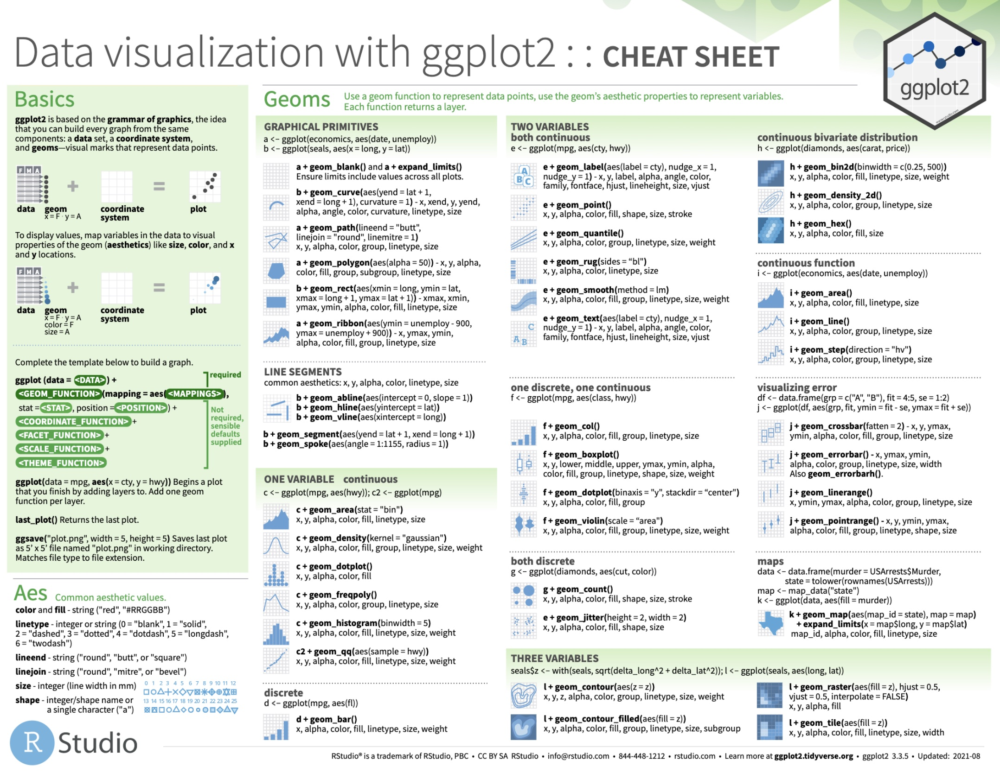
```

.center[The *cheatsheet*:
https://github.com/rstudio/cheatsheets/blob/main/data-visualization-2.1.pdf]

---
class: inverse-green, center, middle
name: part4

# 4. Visualising a categorical variable

.white[*"The bar is open... Let's have a lollipop?" *]

---

## Visualising a categorical variable?

.left-column[
There are many ways to visualise a categorical variable...   

Can you think of some?]

--
.right-column[
```{r echo=F, out.width="70%", out.height="70%", fig.align="center"}
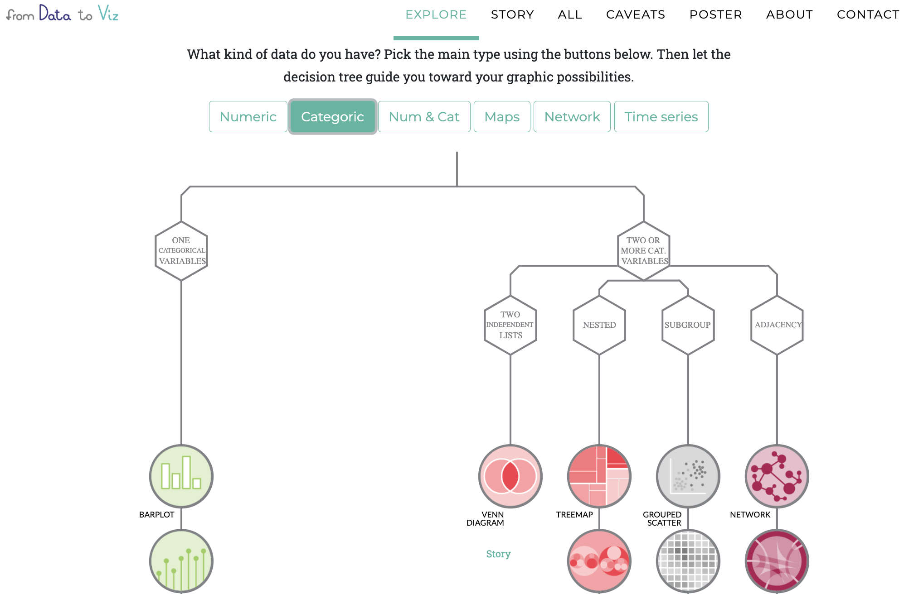
```
<br>   
<br>  
.center[.font100[
*Have a look at [data to viz.com](https://www.data-to-viz.com)*
]
]
]

---

## Creating a barplot with .UA-red[`geom_bar()`] or .UA-red[`geom_col()`] 

.pull-left[
**`geom_bar()`**
```{r, echo = FALSE, fig.width= 3, fig.height=3, fig.align = "left"}
ggplot(penguins,
       aes(
         x = species
       )) +
  geom_bar()
```
]
.pull-right[
**`geom_col()`**
```{r, echo=F, fig.width= 3, fig.height=3, fig.align = "left"}
count_data <- penguins %>%
  count(species, name = "count")

ggplot(count_data,
       aes(
         x = species,
         y = count
       )) +
  geom_col()
```
]

--
.pull-left[.footnotesize[
```{r, echo = T, eval=F}
ggplot(
  penguins,
  aes(
    x = species
    )
  ) +
  geom_bar()

# stat_count() does the counting automatically 
```
]
]
.pull-right[.footnotesize[
```{r, echo=T, eval=F}
count_data <- 
  penguins %>%
  count(species, name = 'count')

ggplot(
  count_data,
  aes(
    x = species,
    y = count
    )
  ) +
  geom_col()
```
]
]

---

## Creating a barplot with .UA-red[`geom_bar()`]

.pull-left[

- Add color to barplot by defining an additional *aesthetic*: **`fill`**

.footnotesize[
```{r, eval = FALSE}
ggplot(
  penguins,
  aes(
    x = species
    )
  ) +
  geom_bar(
    ## Additional aesthetic: "fill"-scale
    aes(fill = species) 
    )
```
]
]

.pull-right[
```{r, echo = FALSE, fig.width= 5, fig.height=5, fig.align = "center"}
ggplot(penguins,
       aes(
         x = species
       )) +
  geom_bar(
    aes(fill = species)
    )
```
]

---

## Creating a barplot with .UA-red[`geom_bar()`]

.pull-left[

- Determine `fill`-colors by adding **`scale_fill_manual()`**

.footnotesize[
```{r, eval = FALSE}
ggplot(
  penguins,
  aes(
    x = species
    )
  ) +
  geom_bar(
    aes(fill = species)
    ) +
  ## Specify fill-colors
  scale_fill_manual( 
    values = c("darkorange", "purple", "cyan4") 
    ) 
```
]
]

.pull-right[
```{r, echo = FALSE, fig.width= 5, fig.height=5, fig.align = "center"}
ggplot(penguins,
       aes(
         x = species
       )) +
  geom_bar(
    aes(fill = species)
    ) +
  scale_fill_manual(
    values = c("darkorange","purple","cyan4")
    )

```
]

---

## Creating a barplot with .UA-red[`geom_bar()`]

.pull-left[

- Add title, subtitle and change label of x-axis using **`labs()`**

.footnotesize[
```{r, eval = FALSE}
ggplot(
  penguins,
  aes(
    x = species
    )
  ) +
  geom_bar(
    aes(fill = species)    ) +
  scale_fill_manual(
    values =
      c("darkorange","purple","cyan4")
    ) +
  ## Add title, subtitle and label x-axis
  labs(
    title = "Palmer penguins",
    subtitle = "n observations for species",
    x = ""
  )
```
]
]

.pull-right[
```{r, echo = FALSE, fig.width= 5, fig.height=5, fig.align = "center"}
ggplot(penguins,
       aes(
         x = species
       )) +
  geom_bar(
    aes(fill = species)
    ) +
  scale_fill_manual(
    values = c("darkorange","purple","cyan4")
    ) +
  labs(
    title = "Palmer penguins",
    subtitle = "n observations for species",
    x = ""
  )

```
]

---

## Creating a barplot with .UA-red[`geom_bar()`]

.pull-left[

- Add another *theme* using **`theme_minimal()`**

.footnotesize[
```{r, eval = FALSE}
ggplot(
  penguins,
  aes(
    x = species
    )
  ) +
  geom_bar(
    aes(fill = species)
    ) +
  scale_fill_manual(
    values =
      c("darkorange","purple","cyan4")
    ) +
  labs(
    title = "Palmer penguins",
    subtitle = "n observations for species",
    x = ""
  ) +
  ## Choose theme
  theme_minimal()
```
]
]

.pull-right[
```{r, echo = FALSE, fig.width= 5, fig.height=5, fig.align = "center"}
ggplot(penguins,
       aes(
         x = species
       )) +
  geom_bar(
    aes(fill = species)
    ) +
  scale_fill_manual(
    values = c("darkorange","purple","cyan4")
    ) +
  labs(
    title = "Palmer penguins",
    subtitle = "n observations for species",
    x = ""
  ) +
  theme_minimal()

```
]

---

## Creating a barplot with .UA-red[`geom_bar()`]

.pull-left[

- Flip x- and y-axis using **`coord_flip()`**  
- Remove legend using **`theme(legend.position = "none")`**  

.footnotesize[
```{r, eval = FALSE}
ggplot(
  penguins,
  aes(
    x = species
    )
  ) +
  geom_bar(
    aes(fill = species)
    ) +
  scale_fill_manual(
    values = c("darkorange","purple","cyan4")
    ) +
  labs(
    title = "Palmer penguins",
    subtitle = "n observations for species",
    x = ""
  ) +  
  ## Flip x- and y-axis
  coord_flip( ) + 
  theme_minimal( ) +
  ## Remove legend
  theme(
    legend.position = "none"
  ) 
```
]
]

.pull-right[
```{r, echo = FALSE, fig.width= 5, fig.height=5, fig.align = "center"}
ggplot(penguins,
       aes(
         x = species
       )) +
  geom_bar(
    aes(fill = species)
    ) +
  scale_fill_manual(
    values = c("darkorange","purple","cyan4")
    ) +
  labs(
    title = "Palmer penguins",
    subtitle = "n observations for species",
    x = ""
  ) +
  coord_flip() +
  theme_minimal(
  ) +
  theme(
    legend.position = "none"
  )

```
]

---

## Creating a lollipop plot

.pull-left[

Use two *geoms*: .UA-red[**`geom_point()`**] and .UA-red[**`geom_segment()`**]   

.font50[
```{r, eval = FALSE}
penguins %>% 
  count(species) %>% 
  ggplot(
    aes(
      x = species, 
      y = n)
    ) + 
  geom_point( 
    aes(col = species) 
  ) +  
  geom_segment(  
    aes(
      x = species,
      xend = species, 
      y = 0, 
      yend = n, 
      col = species
      )
    ) + 
```
]

Re-use remainder of code!  

.font50[
```{r, eval = FALSE}
  scale_fill_manual(
    values = c("darkorange","purple","cyan4")
    ) +
  labs(
    title = "Palmer penguins",
    subtitle = "n observations for species",
    x = ""
  ) +  
  coord_flip( ) + 
  theme_minimal( ) +
  theme(
    legend.position = "none" 
  ) 
```
]
]

.pull-right[
```{r, echo = FALSE, fig.width= 5, fig.height=5, fig.align = "center"}
penguins %>% 
  count(species) %>% 
  ggplot(aes(x = species, y = n)) + #<<
  geom_point( #<<
    aes(col = species) #<<
  ) +  #<<
  geom_segment(  #<< 
    aes( #<<
      x = species, xend = species, #<<
      y = 0, yend = n, col = species) #<<
    ) + #<<
  scale_fill_manual(
    values = c("darkorange","purple","cyan4")
    ) +
  labs(
    title = "Palmer penguins",
    subtitle = "n observations for species",
    x = ""
  ) +  
  coord_flip( ) + 
  theme_minimal( ) +
  theme(
    legend.position = "none" 
  ) 

```
]

---
## Creating a lollipop plot 

.pull-left[
- Reorder 'bars' by creating a new variable using **`fct_reorder()`**

.font50[
```{r, eval = FALSE}
penguins %>% 
  count(species) %>% 
  ## Create an ordered factor
  mutate( 
    species_ord = fct_reorder(species,n) 
    ) %>% 
  ggplot(
    aes(x = species_ord)) + 
  geom_point( 
    aes(col = species) 
  ) + 
  geom_segment(  
    aes(
      x = species,
      xend = species, 
      y = 0, 
      yend = n,
      col = species
      ) 
    ) + 
  scale_fill_manual(
    values = c("darkorange","purple","cyan4")
    ) +
  labs(
    title = "Palmer penguins",
    subtitle = "n observations for species",
    x = ""
  ) +  
  coord_flip( ) + 
  theme_minimal( ) +
  theme(
    legend.position = "none"
    ) 
```
]
]

.pull-right[
```{r, echo = FALSE, fig.width= 5, fig.height=5, fig.align="center"}
penguins %>% 
  count(species) %>% 
  mutate( #<<
    species_ord = fct_reorder(species,n) #<<
    ) %>% #<<
  ggplot(
    aes(x = species_ord, y = n)) + 
  geom_point( 
    aes(col = species) 
  ) + 
  geom_segment(  
    aes(x = species, xend = species, 
        y = 0, yend = n, col = species) 
    ) + 
  scale_fill_manual(
    values = c("darkorange","purple","cyan4")
    ) +
  labs(
    title = "Palmer penguins",
    subtitle = "n observations for species",
    x = ""
  ) +  
  coord_flip( ) + 
  theme_minimal( ) +
  theme(
    legend.position = "none" 
  ) 
```
]

---

## Chosing colors ...

```{r, out.height = "70%", out.width="70%", eval = T, echo = F, fig.align = "left"}
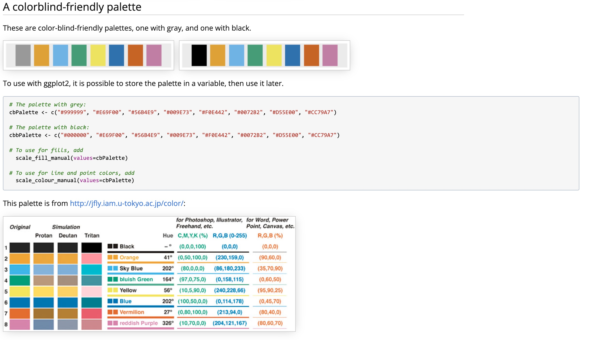
```

.footnote[http://www.cookbook-r.com/Graphs/Colors_(ggplot2)/]

---

class: inverse-blue

# <i class="fas fa-laptop-code" style="color: #FF0035;"></i> Exercises `[ggplot2]` : part 1

.left-column[

]
.right-column[
- You can find the qmd-file .SW-greenD[ `Exercises_ggplot2.qmd`] at the course website.

- Download the qmd-file .SW-greenD[ `Exercises_ggplot2.qmd`] to your laptop  

- Open the file in `RStudio`

- The file contains a set of coding assignments with empty code blocks

- Now, we focus on part 1 of the exercises

- Write the code (and test it by running it)

- Stuck? No Worries! 
  - We are there
  - Help each other
  - There is a solution key (at the website) (.SW-greenD[`Exercises_ggplot2_solutions.qmd`]) 
]
---
class: inverse-green, center, middle
name: part5

# 5. Visualising a quantitative variable

---

## Visualising a quantitative variable?

.left-column[
There are many ways to visualise a quantitative variable...   

Can you think of some?]

--
.right-column[
```{r echo=F, out.width="45%", out.height="45%", fig.align="center"}
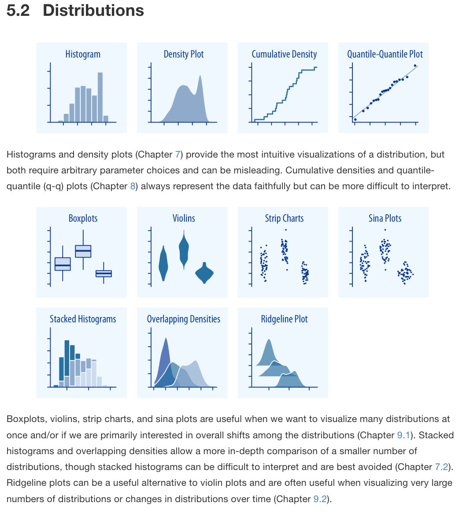
```
<br>   
.right[.font60[
*Taken from [Fundamentals of Data Visualization](https://clauswilke.com/dataviz/directory-of-visualizations.html) by Claus Wilke*
]
]
]

---

## Creating a histogram with .UA-red[`geom_histogram()`]

.pull-left[
.footnotesize[
```{r, eval = FALSE}
ggplot(
  penguins,
  aes(
    x = flipper_length_mm
    )
  ) +
  geom_histogram()
```
]
]

.pull-right[
```{r, echo = FALSE, fig.width= 5, fig.height = 5, fig.align = "center"}
ggplot(penguins,
       aes(
         x = flipper_length_mm,
       )) +
  geom_histogram()
```
]

---

## Creating a histogram with .UA-red[`geom_histogram()`]

.pull-left[

- Change breaks on y-axis using **`scale_y_continuous()`** 

.footnotesize[
```{r, eval = FALSE}
ggplot(
  penguins,
  aes(
    x = flipper_length_mm
    )
  ) +
  geom_histogram() +
  ## Specify breaks
  scale_y_continuous( 
    breaks = c(seq(0, 25, 5), 29) 
    ) 
```
]
]

.pull-right[
```{r, echo = FALSE, fig.width= 5, fig.height = 5, fig.align = "center"}
ggplot(penguins,
       aes(
         x = flipper_length_mm,
       )) +
  geom_histogram() +
  ## Specify breaks
  scale_y_continuous( 
    breaks = c(seq(0, 25, 5), 29)
    )
```
]


---

## Creating a histogram with .UA-red[`geom_histogram()`]


.pull-left[

- Change transparency using argument **`alpha`**   
- Remove minor grid lines using argument **`panel.grid.minor = element_blank()`**

.font60[
```{r, eval = FALSE}
ggplot(
  penguins,
  aes(
    x = flipper_length_mm,
    fill = species
    )
  ) +
  geom_histogram(
    ## Change transparency of points
    alpha = .7 
  ) +
  ## Specify breaks
  scale_y_continuous( 
    breaks = c(seq(0, 25, 5), 29) 
    ) + 
  scale_fill_manual(
    values =
      c("darkorange","purple","cyan4")
    ) +
  labs(
    title = "Palmer penguins",
    subtitle = "Histogram of flipper length",
    x = "Flipper length"
  ) +
  theme_minimal() +
  theme(
    ## Remove minor grid lines
    panel.grid.minor = element_blank()
  ) 
```
]
]

.pull-right[
```{r, echo = FALSE, fig.width= 5, fig.height = 5, fig.align = "center"}
ggplot(penguins,
       aes(
         x = flipper_length_mm,
         fill = species
       )) +
  geom_histogram(
    ## Change transparency of points
    alpha = .7
  ) +
  scale_y_continuous( 
    breaks = c(seq(0, 25, 5), 29) 
    ) + 
  scale_fill_manual(
    values = c("darkorange","purple","cyan4")
    )+
  labs(
    title = "Palmer penguins",
    subtitle = "Histogram of flipper length",
    x = "Flipper length"
  ) +
  theme_minimal() +
  theme(
    ## Remove minor grid lines
    panel.grid.minor = element_blank() 
    )
```
]

---

## Creating a density plot<sup>°</sup> with .UA-red[`geom_density()`]

.pull-left[

- Replace `geom_histogram()` with **`geom_density()`** plot

.footnotesize[
```{r, eval = FALSE}
ggplot(
  penguins,
  aes(
    x = flipper_length_mm,
    fill = species
    )
  ) +
  ## Use geom_density
  geom_density(
    alpha = .7
  ) +
  scale_fill_manual(
    values = c("darkorange","purple","cyan4")
    ) +
  labs(
    title = "Palmer penguins",
    subtitle = "Density plot of flipper length",
    x = "Flipper length"
  ) + 
  theme_minimal()
```
.left[.font70[
<sup>*°*</sup>*surface below curve = 100%*
]]
]
]

.pull-right[
```{r, echo = FALSE, fig.width = 5, fig.height = 5, fig.align = "center"}

ggplot(penguins,
       aes(
         x = flipper_length_mm,
         fill = species
       )) +
  geom_density(
         alpha = .7) +
  scale_fill_manual(
    values = c("darkorange","purple","cyan4")
    )+ 
  labs(
    title = "Palmer penguins",
    subtitle = "Density plot of flipper length",
    x = "Flipper length"
  ) + theme_minimal()
```
]

---

## Creating a density plot with .UA-red[`geom_density()`]

.pull-left[
- Only colored lines by replacing argument **`fill`** with **`color`**

.footnotesize[
```{r, eval = FALSE}
ggplot(
  penguins,
  aes(
    x = flipper_length_mm,
    color = species
    )
  ) +
  geom_density() + 
  ## Replace scale_color with scale_fill
  scale_color_manual( 
    values = c("darkorange","purple","cyan4") 
    ) + 
  labs(
    title = "Palmer penguins",
    subtitle = "Density plot of flipper length",
    x = "Flipper length"
  ) + 
  theme_minimal() +
  theme(
    panel.grid.minor = element_blank()
    )
```
]
]

.pull-right[
```{r, echo = FALSE, fig.width= 5, fig.height=5, fig.align="center"}
ggplot(penguins,
       aes(
         x = flipper_length_mm,
         color = species 
       )) +
  geom_density() + 
  scale_color_manual( 
    values = c("darkorange","purple","cyan4") 
    ) + 
  labs(
    title = "Palmer penguins",
    subtitle = "Density plot of flipper length",
    x = "Flipper length"
  ) + 
  theme_minimal() +
  theme(
    panel.grid.minor = element_blank(),
  )
```
]

---

## Or even better ... .UA-red[`geom_violin()` + `geom_jitter()`]

.pull-left[
.font50[
```{r, eval = FALSE}
ggplot(
  penguins,
  aes(
    x = species,
    y = flipper_length_mm,
    ## Aesthetics fill and color applied to EVERY geom
    fill = species,
    color = species
    )
  ) +
  ## Use geom_violin and geom_jitter
  geom_violin(
    alpha = .65
  ) +
  geom_jitter(
    alpha = .7
  ) +
  scale_fill_manual(
    values = c("darkorange","purple","cyan4")
    ) +
  scale_color_manual(
    values = c("darkorange","purple","cyan4")
    ) +
  labs(
    title = "Palmer penguins",
    subtitle = "Density plot voor flipper lengte",
    y = "Flipper length",
    x = "",
  ) + 
  theme_minimal() +
  theme(
    legend.position = "none"
    )
```
]
]

.pull-right[
```{r, echo = FALSE, fig.width= 5, fig.height = 5}
ggplot(penguins,
       aes(
         x = species,
         y = flipper_length_mm,
         fill = species,
         color = species
       )) +
  geom_violin(
    alpha = .65
  ) +
  geom_jitter(
    alpha = .7
  ) +
  scale_fill_manual(
    values = c("darkorange","purple","cyan4")
    ) +
  scale_color_manual(
    values = c("darkorange","purple","cyan4")
    ) +
  labs(
    title = "Palmer penguins",
    subtitle = "Density plot voor flipper lengte",
    y = "Flipper length",
    x = "",
  ) + theme_minimal() + theme(legend.position = "none")
```
]

---

## Or even better .UA-red[`geom_violin()` + `geom_jitter()`]

.pull-left[
- Put names of species on top using argument **`position="top"`**   
- Remove minor grid lines using argument **`panel.grid.major = element_blank()`**

.font40[
```{r, eval = FALSE}
ggplot(
  penguins,
  aes(
    x = species,
    y = flipper_length_mm,
    fill = species,
    color = species
    )
  ) +
  geom_violin(
    alpha = .65
  ) +
  geom_jitter(
    alpha = .7
  ) +
  scale_x_discrete(
    position = "top"
    ) +
  scale_fill_manual(
    values = c("darkorange","purple","cyan4")
    ) +
  scale_color_manual(
    values = c("darkorange","purple","cyan4")
    ) +
  labs(
    title = "Palmer penguins",
    subtitle = "Density plot of flipper length",
    y = "Flipper length",
    x = "",
  ) + 
  theme_minimal() + 
  theme(
    legend.position = "none",
    panel.grid.minor = element_blank(),
    ## Remove major grid lines
    panel.grid.major.x = element_blank()
    ) 
```
]
]

.pull-right[
```{r, echo = FALSE, fig.width= 5, fig.height=5}
ggplot(penguins,
       aes(
         x = species,
         y = flipper_length_mm,
         fill = species,
         color = species
       )) +
  geom_violin(
    alpha = .65
  ) +
  geom_jitter(
    alpha = .7
  ) +
  scale_x_discrete(position = "top") +
  scale_fill_manual(
    values = c("darkorange","purple","cyan4")
    ) +
  scale_color_manual(
    values = c("darkorange","purple","cyan4")
    ) +
  labs(
    title = "Palmer penguins",
    subtitle = "Density plot of flipper length",
    y = "Flipper length",
    x = "",
  ) + 
  theme_minimal() + 
  theme(legend.position = "none",
    panel.grid.minor = element_blank(),
    panel.grid.major.x = element_blank())
```
]

---

## Or a *rain cloud plot*  

```{r, echo = F, fig.align = "center", fig.width=6, fig.height=6}
library(ggdist)
ggplot(penguins, aes(x = species, y = flipper_length_mm)) + 
  ggdist::stat_halfeye(
    adjust = .5, 
    width = .6, 
    .width = 0, 
    justification = -.2, 
    point_colour = NA
  ) + 
  geom_boxplot(
    width = .15, 
    outlier.shape = NA
  ) +
  geom_point(
    size = 1.3,
    alpha = .3,
    position = position_jitter(
      seed = 1, width = .1
  )) +
  labs(
    title = "Palmer penguins",
    subtitle = "Distribution of flipper length by species",
    x = "",
    y = "Flipper length"
  ) +
  coord_cartesian(xlim = c(1.2, NA), clip = "off") +
  coord_flip() +
  theme_minimal()
```

.center[.font60[*Based on the tutorial of Cédric Scherer: https://www.cedricscherer.com/*]]

---
name: raincloud
## Or a *rain cloud plot*  ([Appendix 1: How to grow a rain cloud plot?](#appendix1))

Additional package required: .UA-red[`ggdist`]

.footnotesize[
```{r, eval = F, echo = T, fig.align = "center", fig.width=5.5, fig.height=5.5}
library(ggdist)
ggplot(penguins, aes(x = species, y = flipper_length_mm)) + 
  stat_halfeye(
    adjust = .5, 
    width = .6, 
    .width = 0, 
    justification = -.2, 
    point_colour = NA
  ) + 
  geom_boxplot(
    width = .15, 
    outlier.shape = NA
  ) +
  geom_point(
    size = 1.3,
    alpha = .3,
    position = position_jitter(
      seed = 1, width = .1
  )) +
  labs(
    title = "Palmer penguins",
    subtitle = "Distribution of flipper length by species",
    x = "",
    y = "Flipper length"
  ) +
  coord_cartesian(xlim = c(1.2, NA), clip = "off") +
  coord_flip() +
  theme_minimal()
```
]
---
class: inverse-blue

# <i class="fas fa-laptop-code" style="color: #FF0035;"></i> Exercises `[ggplot2]` : part 2

.left-column[

]
.right-column[
- You can find the qmd-file .SW-greenD[ `Exercises_ggplot2.qmd`] at the course website.

- Download this file to your laptop

- Open the file in `RStudio`

- The file contains a set of coding assignments with empty code blocks

- Now, we focus on part 2 of the exercises

- Write the code (and test it by running it)

- Stuck? No Worries! 
  - We are there
  - Help each other
  - There is a solution key (.SW-greenD[`Exercises_ggplot2_solutions.qmd`]) 
]

---
class: inverse-green, center, middle
name: part6

# 6. Visualising more than one variable

---

## Visualising more than one variable?
.left-column[
There are many ways to visualise more than one variable... 
The choice depends (among other things) on the type of variables you want to plot: 
- only quantitative variables;  
- only qualitative variables;  
- or a combination of both    

Can you think of an example of each?]

--
.right-column[
```{r echo=F, out.width="70%", out.height="70%", fig.align="center"}
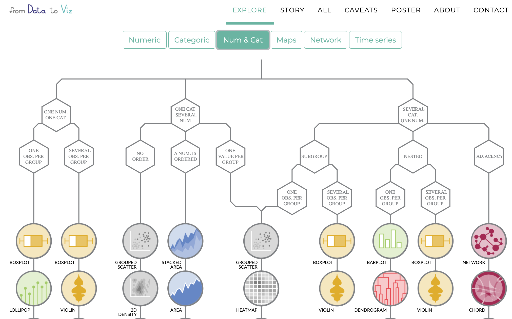
```
<br>   
.center[.font100[
*Have a look at [data to viz.com](https://www.data-to-viz.com)*
]
]
]

---

## Visualising more than one variable  
<br>  
<br>  
We focus today upon:
- **scatterplots** .font80[(two numeric variables,  two numeric variables and one categorical variable)]  
- **grouped barplots**  .font80[(two categorical variables)]   

---

## Creating a scatterplot with .UA-red[`geom_point()`]

.pull-left[
.footnotesize[
```{r, eval = FALSE}
ggplot(
  penguins,
  aes(
    x = body_mass_g,
    y = flipper_length_mm
    )
  ) +
  geom_point() +
  labs(
    title = "Palmer penguins",
    subtitle = "Relation of flipper length with body mass",
    y = "Flipper length",
    x = "Body mass",
  ) + 
  theme_minimal() + 
  theme(
    legend.position = "none"
    )
```
]
]

.pull-right[
```{r, echo = FALSE, fig.width= 5, fig.height=5}
ggplot(penguins,
       aes(
         x = body_mass_g,
         y = flipper_length_mm
       )) +
  geom_point() +
  labs(
    title = "Palmer penguins",
    subtitle = "Relation of flipper length with body mass",
    y = "Flipper length",
    x = "Body mass"
  ) + 
  theme_minimal() + 
  theme(legend.position = "none")
```
]

---
## Creating a scatterplot with  .UA-red[`geom_point()`] and .UA-red[`geom_smooth()`]

.pull-left[
.footnotesize[

- Add trend line using **`geom_smooth()`**  

```{r, eval = FALSE}
ggplot(
  penguins,
  aes(
    x = body_mass_g,
    y = flipper_length_mm
    )
  ) +
  geom_point() +
  ## Add a trendline
  geom_smooth() +
  labs(
    title = "Palmer penguins",
    subtitle = "Relation of flipper length with body mass",
    y = "Flipper length",
    x = "Body mass"
  ) + 
  theme_minimal() + 
  theme(
    legend.position = "none"
    )
```
]
]

.pull-right[
```{r, echo = FALSE, fig.width= 5, fig.height=5}
ggplot(penguins,
       aes(
         x = body_mass_g,
         y = flipper_length_mm
       )) +
  geom_point() +
  geom_smooth() +
  labs(
    title = "Palmer penguins",
    subtitle = "Relation of flipper length with body mass",
    y = "Flipper length",
    x = "Body mass"
  ) + 
  theme_minimal() + 
  theme(legend.position = "none")
```
]

---

## Creating a scatterplot with  .UA-red[`geom_point()`] and .UA-red[`geom_smooth()`]

.pull-left[

- Linear trend line using argument **`method = "lm"`**      
- Remove confidence intervals using argument **`se = FALSE`**    

.footnotesize[
```{r, eval = FALSE}
ggplot(
  penguins,
  aes(
    x = body_mass_g,
    y = flipper_length_mm
    )
  ) +
  geom_point() +
  geom_smooth( 
    ## Add linear trend line
    method = "lm", 
    ## Remove confidence band
    se = FALSE 
  ) + 
  labs(
    title = "Palmer penguins",
    subtitle = "Correlation between flipper length and body mass",
    y = "Flipper length",
    x = "Body mass",
  ) + 
  theme_minimal() + 
  theme(
    legend.position = "none"
    )
```
]
]

.pull-right[
```{r, echo = FALSE, fig.width= 5, fig.height=5, fig.align = "center"}
ggplot(penguins,
       aes(
         x = body_mass_g,
         y = flipper_length_mm
       )) +
  geom_point() +
  geom_smooth(
    method = "lm",
    se = FALSE
  ) +
  labs(
    title = "Palmer penguins",
    subtitle = "Correlation between flipper length and body mass",
    y = "Flipper length",
    x = "Body mass",
  ) +
  theme_minimal() + 
  theme(legend.position = "none")
```
]

---

## Creating a scatterplot with  .UA-red[`geom_point()`] and .UA-red[`geom_smooth()`]

.pull-left[

- Add shape and color by specifying *aesthetics*: **`shape`** and **`color`**  
- Change legend position and background, position of plot title, and layout  of (sub)title   

.font40[
```{r, eval = FALSE}
ggplot(
  penguins,
  aes(
    x = flipper_length_mm,
    y = body_mass_g
    )
  ) +
  geom_point(
    aes(
      color = species,
      shape = species
      ),
    size = 3,
    alpha = 0.8
    ) +
  geom_smooth(
    aes(color = species),
    se = F, 
    method = "lm"
    ) +
  theme_minimal() +
  scale_color_manual(
    values = c("darkorange","purple","cyan4")) +
  labs(
    title = "Palmer penguins",
    subtitle = "Correlation between flipper length and body mass",
    y = "Flipper length",
    x = "Body mass",
    color = "Species", 
    shape = "Species") + 
  theme(
    legend.position = c(0.2, 0.7), 
    legend.background = element_rect(fill = "white", color = NA),
    plot.title.position = "plot",
    plot.title = element_text(hjust = 0, face= "bold"),
    plot.subtitle = element_text(hjust = 0, face= "italic")
    ) 
```
]
]

.pull-right[
```{r ,echo = FALSE, fig.width = 5, fig.height = 5, fig.align = "center"}
ggplot(data = penguins,
       aes(x = flipper_length_mm,
           y = body_mass_g)) +
  geom_point(aes(color = species,
                 shape = species),
             size = 3,
             alpha = 0.8) +
  geom_smooth(
    aes(color = species),
    se = F, method = "lm"
    ) +
  theme_minimal() +
  scale_color_manual(values = c("darkorange","purple","cyan4")) +
  labs(
    title = "Palmer penguins",
    subtitle = "Correlation between flipper length and body mass",
    y = "Flipper length",
    x = "Body mass",
    color = "Specie", 
    shape = "Specie")  + 
  theme(## Change position legend
        legend.position = c(0.2, 0.7), 
        ## Change background legend
        legend.background = element_rect(fill = "white", color = NA), 
        ## Change position of plot title
        plot.title.position = "plot",
        ## Change layout of plot (sub)title
        plot.title = element_text(hjust = 0, face= "bold"),
        plot.subtitle = element_text(hjust = 0, face= "italic")) 
```
]

---

## Creating a scatterplot with  .UA-red[`geom_point()`] and .UA-red[`geom_smooth()`]

.pull-left[

- Adds facets using **`facet_wrap()`**  

.font60[
```{r, eval = FALSE}
ggplot(
  penguins,
  aes(
    x = body_mass_g,
    y = flipper_length_mm
    )
  ) +
  geom_point( ) +
  geom_smooth(
    method = "lm",
    se = FALSE
  ) +
  facet_wrap(~species) + 
  labs(
    title = "Palmer penguins",
    subtitle = "Correlation between flipper length and body mass",
    y = "Flipper length",
    x = "Body mass",
  ) + 
  theme_minimal() + 
  theme(
    legend.position = "none",
    plot.title = element_text(hjust = 0, face= "bold"),
    plot.subtitle = element_text(hjust = 0, face= "italic")
    ) 
```
]
]

.pull-right[
```{r, echo = FALSE, fig.width= 5, fig.height=5, fig.align = "center"}
ggplot(penguins,
       aes(
         x = body_mass_g,
         y = flipper_length_mm
       )) +
  geom_point(
  ) +
  geom_smooth(
    method = "lm",
    se = FALSE
  ) +
  facet_wrap(.~species) +
  labs(
    title = "Palmer penguins",
    subtitle = "Correlation between flipper length and body mass",
    y = "Flipper length",
    x = "Body mass",
  ) + 
  theme_minimal() + 
  theme(legend.position = "none",
        plot.title = element_text(hjust = 0, face= "bold"),
        plot.subtitle = element_text(hjust = 0, face= "italic"))
```
]

---

## Creating a barplot of two variables (counts)

.pull-left[
Grouped barplot of counts using  
**`position_dodge()`**  

```{r, echo = FALSE, fig.width= 3, fig.height=3, fig.align = "left"}
penguins %>% 
  ggplot(
    aes(
      x = island,
      fill = species
      )
    ) +
  geom_bar(
    position = position_dodge()
    ) +
  theme_minimal()
```
]
.pull-right[
Stacked barplot of counts using argument  
**`position_stack()`** 

```{r, echo=F, fig.width= 3, fig.height=3, fig.align = "left"}
penguins %>% 
  ggplot(aes(x = island,
             fill = species)) +
  geom_bar(
    position = position_stack()
    ) +
  theme_minimal()
```
]

--
.pull-left[.footnotesize[
```{r, echo = T, eval=F}
penguins %>% 
  ggplot(
    aes(
      x = island,
      fill = species
      )
    ) +
  geom_bar(
    position = position_dodge()
    ) +
  theme_minimal()
```
]
]
.pull-right[.footnotesize[
```{r, echo=T, eval=F}
penguins %>% 
  ggplot(
    aes(
      x = island,
      fill = species)
    ) +
  geom_bar(
    position = position_stack()
    ) +
  theme_minimal()
```
]
]

---

## Creating a barplot of two variables (percentage)

.pull-left[

- Switch to relative frequencies using **`position_fill()`**  

```{r, eval = FALSE}
penguins %>% 
  ggplot(
    aes(
      x = island,
      fill = species
      )
    ) +
  geom_bar(
    position = position_fill()
    ) +
  theme_minimal()
```
]
.pull-right[
```{r, echo=F, fig.width= 5, fig.height=5, fig.align = "center"}
penguins %>% 
  ggplot(aes(x = island,
             fill = species)) +
  geom_bar(
    position = position_fill()
    ) +
  theme_minimal()
```
]

---

## Creating a barplot of two variables (percentage)

.pull-left[
- Add texts to bars using **`geom_text()`**  
- Add "fill" colors using **`scale_fill_brewer()`**  
- Remove additional space using **`coord_cartesian(expand=FALSE)`**  

.font40[
```{r, eval = FALSE}
penguins %>% 
  ggplot(
    aes(
      x = island,
      fill = species
      )
    ) +
  geom_bar(
    position = position_fill(),
    alpha = .9
    ) +
  geom_text(
    aes(label = ..count..),
    stat = "count",
    colour = "white",
    position = position_fill(vjust = 0.5)
    ) +
  scale_fill_brewer(
    type = "qual", 
    palette = 6
  ) +
  scale_x_discrete(position = "top")+
  scale_y_continuous(breaks = c(0.5, 1)) +
  labs(
    title = "Palmer penguins",
    subtitle = "Distribution of penguin species by island",
    fill = "Species"
  ) +
  coord_cartesian(expand = FALSE) +
  theme_minimal() + 
  theme(
    plot.title = element_text(size = 20, face = "bold"),
    plot.subtitle = element_text(size = 16, face = "italic"),
    axis.title = element_blank(),
    axis.text.x = element_text(size = 14, face = "bold"),
    legend.title = element_text(face = "bold"),
    panel.grid.minor = element_blank(),
    panel.grid.major.x = element_blank()
    )
```
]
]
.pull-right[
```{r ,echo = FALSE, fig.width= 7, fig.height=6}
penguins %>% 
  ggplot(aes(x = island,
             fill = species)) +
  geom_bar(
    position = position_fill(),
    alpha = .9
    ) +
  geom_text(aes(label = ..count..),
            stat = "count",
            colour = "white",
            position = position_fill(vjust = 0.5)) +
  scale_fill_brewer(
    type = "qual", 
    palette = 6
  ) +
  scale_x_discrete(position = "top")+
  scale_y_continuous(breaks = c(0.5, 1)) +
  labs(
    title = "Palmer penguins",
    subtitle = "Distribution of penguin species by island",
    fill = "Species"
  ) +
  coord_cartesian(expand = FALSE) +
  theme_minimal() + 
  theme(plot.title = element_text(size = 20, face = "bold"),
        plot.subtitle = element_text(size = 16, face = "italic"),
        axis.title = element_blank(),
        axis.text.x = element_text(size = 14, face = "bold"),
        legend.title = element_text(face = "bold"),
        panel.grid.minor = element_blank(),
        panel.grid.major.x = element_blank())
```
]

---

## Chosing colors ...

.pull-left[
- Colors are not meaningless and ... they grab attention  

-  R has several built-in color palettes. The functions `scale_fill_brewer` and  `scale_color_brewer` use palettes of [RColorBrewer](https://r-graph-gallery.com/38-rcolorbrewers-palettes.html). These palettes come in three 'flavours':
  - **sequential**: for ordered data .font80[((for example, scoring low/mediocre/high on a likert scale)]   
  - **qualitative**: for nominal or categorical information .font80[(for example, different islands)] 
  - **diverging**: for ordered data with meaningful mid values .font80[((for example, temperature or change in score)]   
   
]
.pull-right[
```{r echo=F, out.width = "65%", fig.align = "center"}
knitr::include_graphics("http://www.sthda.com/sthda/RDoc/figure/graphs/colors-in-r-rcolorbrewer-palettes.png")
```
]


---
class: inverse-blue

# <i class="fas fa-laptop-code" style="color: #FF0035;"></i> Exercises `[ggplot2]` : part 3

.left-column[

]
.right-column[
- You can find the qmd-file .SW-greenD[ `Exercises_ggplot2.qmd`] at the course website.

- Download this file to your laptop

- Open the file in `RStudio`

- The file contains a set of coding assignments with empty code blocks

- Now, we focus on part 3 of the exercises

- Write the code (and test it by running it)

- Stuck? No Worries! 
  - We are there
  - Help each other
  - There is a solution key (.SW-greenD[`Exercises_ggplot2_solutions.qmd`]) 
]


---
class: inverse-green, center, middle
name: part7

# 7. More about visualisation?

---

## The tip of the icebeRg...

.pull-left[
.center[
[Gallery of different types of visualisations accompanied by ggplot-code](https://r-graph-gallery.com/index.html)]  

```{r echo=FALSE, out.height = "60%", out.width="60%", fig.align = "center"}
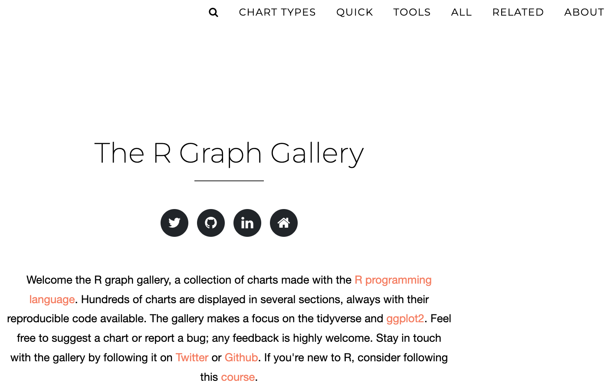
```
 ]   

.pull-right[
.center[
[Top50 ggplot visualisations...](http://r-statistics.co/Top50-Ggplot2-Visualizations-MasterList-R-Code.html)]  

``` {r echo=FALSE, out.height = "60%", out.width="60%", fig.align = "center"}
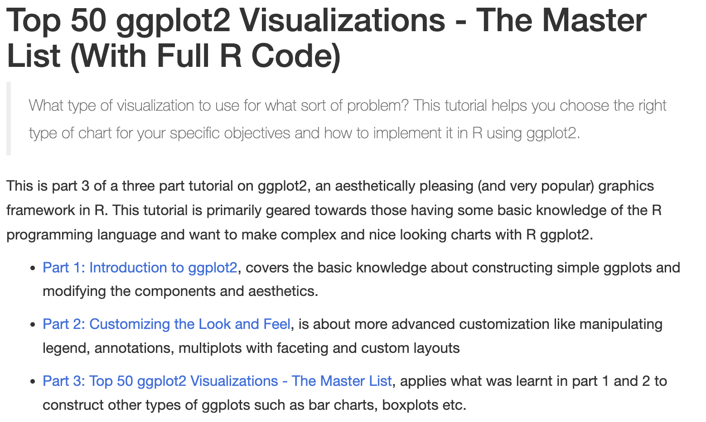
```
]

.pull-left[
.center[
[library of graphs with ggplot-code](https://r-charts.com/ggplot2/) 
]

``` {r echo=FALSE, out.height = "60%", out.width="60%", fig.align = "center"}
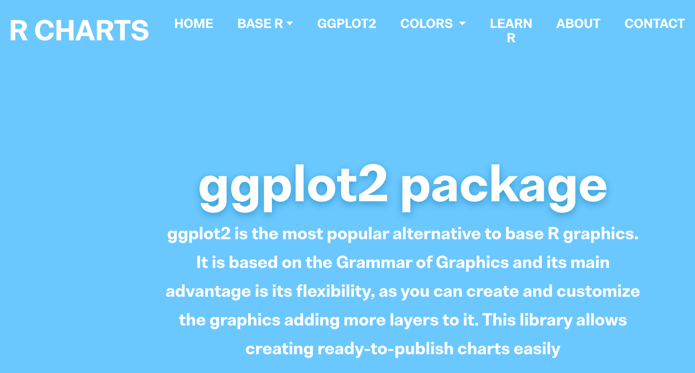
```
]   

.pull-right[
.center[
[ggplot-extentions](https://exts.ggplot2.tidyverse.org/gallery/)
]

``` {r echo=FALSE, out.height = "65%", out.width="65%", fig.align = "center"}
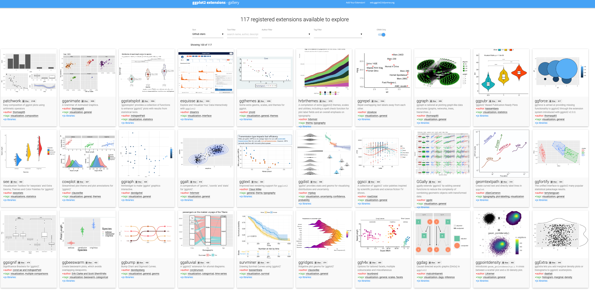
```
] 

---

## Which visualisation to use?

.pull-left[
.center[
[Visual vocabulary](http://ft-interactive.github.io/visual-vocabulary/)]  
```{r echo=FALSE, out.height = "60%", out.width="60%", fig.align = "center"}
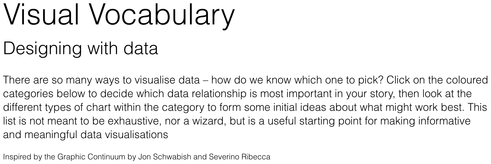
```
]   

.pull-right[
.center[
[The Data Visualisation Catalogue](https://datavizcatalogue.com/search.html)]       
``` {r echo=FALSE, out.height = "40%", out.width="40%", fig.align = "center"}
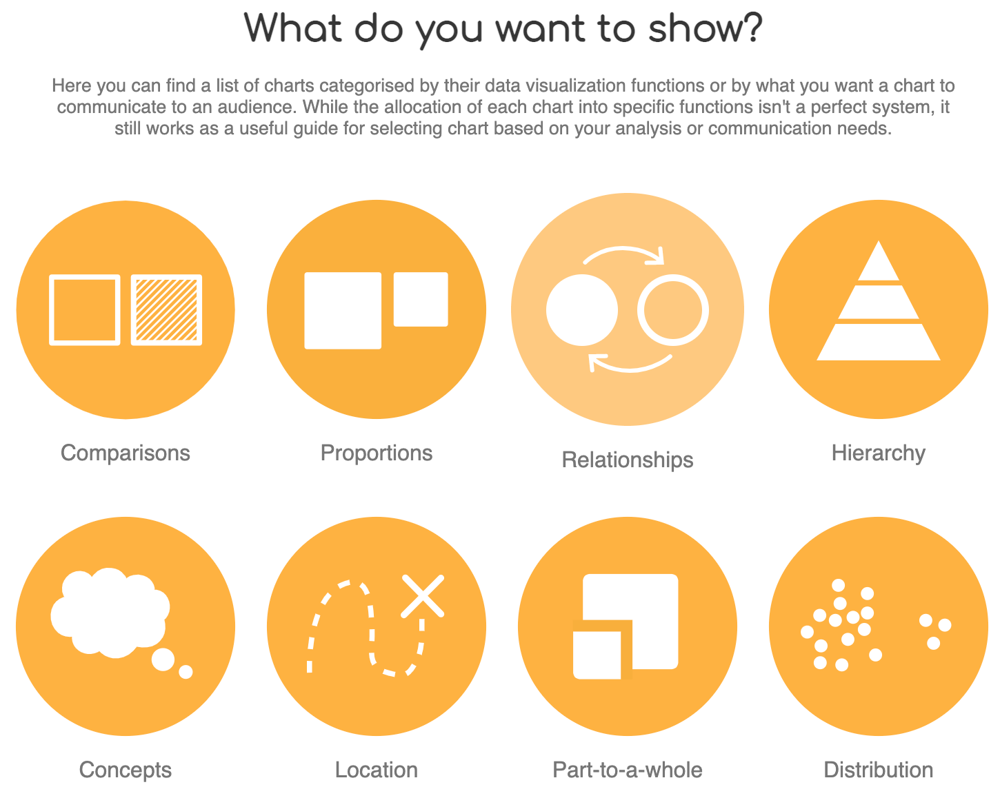
```
]
<br>  
.pull-left[
.center[
[Research visuals: all the resources ...](https://baryon.be/visuals-resources/) 
]
``` {r echo=FALSE, out.height = "60%", out.width="60%", fig.align = "center"}

```
]   

.pull-right[
.center[
[Website of Cedric Scherer](https://www.cedricscherer.com/)]
``` {r echo=FALSE, out.height = "60%", out.width="60%", fig.align = "center"}
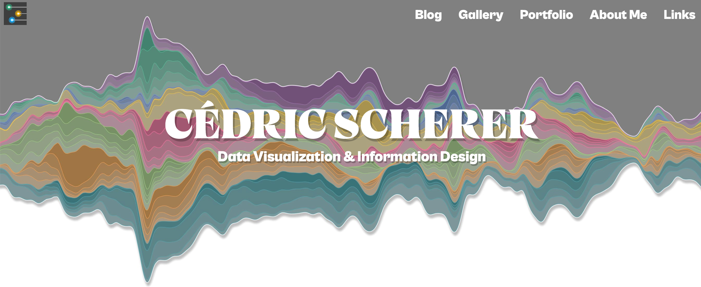
```
]

---

## In need of help?

.pull-left[**Don't forget RStudio's help-function!**
<br>
```{r, echo=FALSE, out.height = "70%", out.width="70%"}
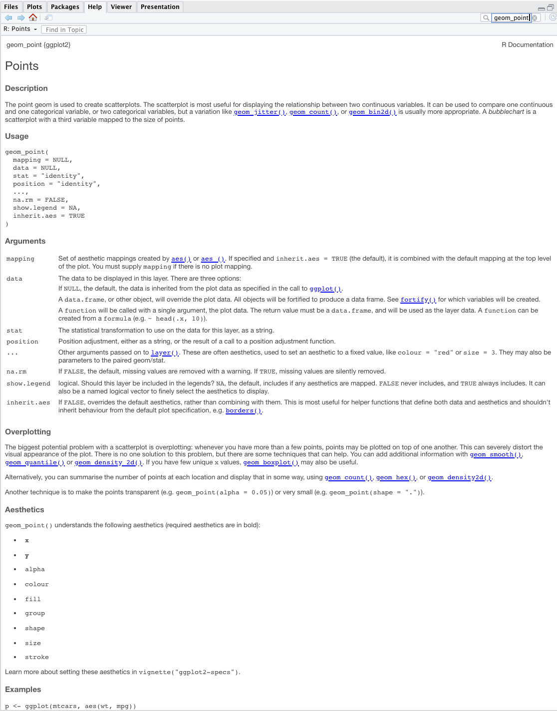
```
]

.pull-right[
**Google is your best fRiend...**

Just google your question and you'll find code, examples, ...

**Generative AI can help as well!**
]


---
class: inverse-green, center, middle
name: appendix1


# Appendix 1 

*How to grow a rain cloud plot?*

<br> <br><br>

[Back to slide show...](#raincloud)

---

## Step 1
.pull-left[

.footnotesize[


```{r, eval = F, echo = T, fig.align = "center", fig.width=5.5, fig.height=5.5}
library(ggdist)

P1 <- 
  ggplot(
    penguins, 
    aes(
      x = species,
      y = flipper_length_mm
      )
    ) + 
  stat_halfeye() 

P1
```
]

]

.pull-right[
```{r, eval = T, echo = F, fig.align = "center"}
library(ggdist)

P1 <- 
  ggplot(penguins, aes(x = species, y = flipper_length_mm)) + 
  stat_halfeye(
  ) 

P1
```
]

---

## Step 2
.pull-left[

.footnotesize[
```{r, eval = F, echo = T, fig.align = "center", fig.width=5.5, fig.height=5.5}
P1 <- 
  ggplot(
    penguins, 
    aes(
      x = species, 
      y = flipper_length_mm
      )
    ) + 
  stat_halfeye(
    adjust = .5, 
    width = .6, 
    .width = 0, 
    justification = -.2, 
    point_colour = NA
  ) 

P1
```
]

]

.pull-right[
```{r, eval = T, echo = F, fig.align = "center"}
P1 <- 
  ggplot(penguins, aes(x = species, y = flipper_length_mm)) + 
  stat_halfeye(
    adjust = .5, 
    width = .6, 
    .width = 0, 
    justification = -.2, 
    point_colour = NA
  ) 

P1
```
]


---

## Step 3

.pull-left[

.footnotesize[
```{r, eval = F, echo = T, fig.align = "center", fig.width=5.5, fig.height=5.5}
P2 <- P1 + 
  geom_boxplot(
    width = .15, 
    outlier.shape = NA
  ) 

P2
```
]

]

.pull-right[
```{r, eval = T, echo = F, fig.align = "center"}
P2 <- P1 + 
  geom_boxplot(
    width = .15, 
    outlier.shape = NA
  ) 

P2
```
]

---

## Step 4

.pull-left[

.footnotesize[
```{r, eval = F, echo = T, fig.align = "center", fig.width=5.5, fig.height=5.5}
P3 <- P2 + 
  geom_point(
    size = 1.3,
    alpha = .3,
    position = position_jitter(
      seed = 1,
      width = .1
      )
    ) 

P3
```
]

]

.pull-right[
```{r, eval = T, echo = F, fig.align = "center"}
P3 <- P2 + 
  geom_point(
    size = 1.3,
    alpha = .3,
    position = position_jitter(
      seed = 1, width = .1
  )) 

P3
```
]

---

## Step 5

.pull-left[

.footnotesize[
```{r, eval = F, echo = T, fig.align = "center", fig.width=5.5, fig.height=5.5}
P4 <- P3 + 
  labs(
    title = "Palmer penguins",
    subtitle = "Distribution of flipper length by species",
    x = "",
    y = "Flipper length"
  ) 

P4
```
]

]

.pull-right[
```{r, eval = T, echo = F, fig.align = "center"}
P4 <- P3 + 
  labs(
    title = "Palmer penguins",
    subtitle = "Distribution of flipper length by species",
    x = "",
    y = "Flipper length"
  ) 

P4
```
]

---

## Step 6

.pull-left[

.footnotesize[
```{r, eval = F, echo = T, fig.align = "center", fig.width=5.5, fig.height=5.5}
P5 <- P4 +
  coord_cartesian(xlim = c(1.2, NA), clip = "off") +
  coord_flip() +
  theme_minimal() +
  theme(
    plot.title.position = "plot",
    plot.title = element_text(face = "bold"),
    plot.subtitle = element_text(face = "italic")
    )

P5
```
]

]

.pull-right[
```{r, eval = T, echo = F, fig.align = "center"}
P5 <- P4 +
  coord_cartesian(xlim = c(1.2, NA), clip = "off") +
  coord_flip() +
  theme_minimal() +
  theme(plot.title.position = "plot",
        plot.title = element_text(face = "bold"),
        plot.subtitle = element_text(face = "italic"))

P5
```
]
---
class: inverse-green, center, middle

## THE RAIN CLOUD PLOTS / [Back to slide show...](#raincloud)

```{r, eval = T, echo = F, fig.align = "center", fig.width=7, fig.height=7}
P5
```
