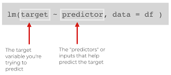

class: title-slide, center, middle

<link rel="stylesheet" href="https://use.fontawesome.com/releases/v5.6.0/css/all.css" integrity="sha384-aOkxzJ5uQz7WBObEZcHvV5JvRW3TUc2rNPA7pe3AwnsUohiw1Vj2Rgx2KSOkF5+h" crossorigin="anonymous">


```{r setup, echo = FALSE, message = FALSE, waning = FALSE, error = FALSE}
knitr::opts_chunk$set(fig.retina = 3, warning = FALSE, message = FALSE)
extrafont::loadfonts()
library(readxl)
library(tidyverse)
library(patchwork)
library(here)

library(palmerpenguins)
data("penguins")
```

<style>

.center2 {
  margin: 0;
  position: absolute;
  top: 50%;
  left: 50%;
  -ms-transform: translate(-50%, -50%);
  transform: translate(-50%, -50%);
}

.rcorners1 {
  margin: auto;
  border-radius: 25px;
  background: #ada500;
  padding: 10px;
#  width: 50%;
}
</style>

```{css echo=FALSE}
.right-column{
  padding-top: 0;
}

.remark-code, .remark-inline-code { font-family: 'Source Code Pro', 'Lucida Console', Monaco, monospace;
                                    font-size: 90%;
                                  }

```


<div class="my-logo-left">  </div>
<div class="my-logo-right">  </div>


# ICO Workshop R & RStudio
.font160[
.SW-greenD[Part 5]
]
.font120[
.SW-greenD[*Statistical analyses in*] .UA-red[*`R`*]
]
Sven De Maeyer & Tine van Daal

.font80[
.UA-red[
2nd - 4th July, 2024
]
]

---
class: inverse-green, left

# Overview

.center2[

- Correlation --- ([Click here](#part1))
- t-test --- ([Click here](#part2))
- Linear regression --- ([Click here](#part3))
]

---
class: inverse-green, center, middle
name: part1

# 1. Correlation

---

## The .UA-red[`cor( )`] function

.pull-left[
```{r, eval = T, echo = F, fig.width = 5, fig.height=5}
penguins %>%
  ggplot(
    aes(y = flipper_length_mm, x = body_mass_g)
  ) +
  geom_point() +
  labs(
    title = "Palmer Penguins",
    subtitle = "Body mass against Flipper length",
    y = "Flipper length (mm)",
    x = "Body mass (gr)"
      ) +
  theme_minimal() +
  theme(
    plot.title.position = "plot"
  )
  

```
]

.pull-right[
.UA-red[Watch out for NA's!!]
.footnotesize[
```{r}
library(palmerpenguins)
data("penguins")

cor(penguins$flipper_length_mm, 
    penguins$body_mass_g)

cor(penguins$flipper_length_mm, 
    penguins$body_mass_g, 
   use = "complete.obs")
```
]
]

---

## Statistical tests with .UA-red[`cor.test( )`]

```{r}
cor.test(penguins$flipper_length_mm, 
        penguins$body_mass_g)
```

---
<div class="my-logo-right">  </div>

## The .UA-red[`broom`]  package

- Package in `tidyverse` 

- Creates .SW-greenD[**tibbles**] based on results from a statistical analysis!

.UA-red[`tidy()`]: output from an analysis as a tibble

```{r}
library(broom)
C <- cor.test(penguins$flipper_length_mm, 
        penguins$body_mass_g)

tidy(C)
```

---

## Correlation between multiple variabeles

```{r}
penguins %>% 
  select(
    bill_depth_mm,
    bill_length_mm,
    flipper_length_mm,
    body_mass_g
  ) %>%
  cor(use = "pairwise.complete.obs")
```

---

## Correlations between multiple variabeles visualized

.pull-left[
Package: .UA-red[`GGally`]

Function: .UA-red[`ggpairs()`]

Result: a ggplot object...

.footnotesize[
```{r, eval = F}
library(GGally)
penguins %>% 
  select(
    species,
    bill_depth_mm,
    bill_length_mm,
    flipper_length_mm,
    body_mass_g
  ) %>%
  ggpairs(
    columns = c(
      "flipper_length_mm", "body_mass_g",
      "bill_length_mm", "bill_depth_mm")
    )
```
]
]

.pull-right[
```{r, echo = F}
library(GGally)
penguins %>% 
  select(
    species,
    bill_depth_mm,
    bill_length_mm,
    flipper_length_mm,
    body_mass_g
  ) %>%
  ggpairs(
    columns = c("flipper_length_mm", "body_mass_g",
                "bill_length_mm", "bill_depth_mm"))
```
]

---

## Correlations between multiple variabeles visualized WITH COLOR!


.pull-left[

.footnotesize[
```{r, eval = F}
penguins %>% 
  select(
    species,
    bill_depth_mm,
    bill_length_mm,
    flipper_length_mm,
    body_mass_g
  ) %>%
  ggpairs(
    aes(color = species),
    columns = c(
      "flipper_length_mm", "body_mass_g",
      "bill_length_mm", "bill_depth_mm")) +
  scale_colour_manual(
    values = c("darkorange","purple","cyan4")) +
  scale_fill_manual(
    values = c("darkorange","purple","cyan4"))
```
]
]

.pull-right[
```{r, eval = T, echo  = F}
penguins %>% 
  select(
    species,
    bill_depth_mm,
    bill_length_mm,
    flipper_length_mm,
    body_mass_g
  ) %>%
  ggpairs(
    aes(color = species),
    columns = c("flipper_length_mm", "body_mass_g",
                "bill_length_mm", "bill_depth_mm")) +
  scale_colour_manual(values = c("darkorange","purple","cyan4")) +
  scale_fill_manual(values = c("darkorange","purple","cyan4"))
```
]

---
class: inverse-green, center, middle
name: part2

# 2. t-test

---
## First some descriptives

.pull-left[
Compare Gentoo with Adelie penguins on `body_mass_g`

.footnotesize[
```{r, eval = F}
library(kableExtra)
penguins %>% 
  select(
    species,
    body_mass_g
  ) %>%
  filter(
    species == 'Adelie' | species == 'Gentoo'
  ) %>%
  group_by(species) %>%
  summarize(
    count = n(),
    mean = mean(body_mass_g, na.rm = TRUE),
    sd = sd(body_mass_g, na.rm = TRUE)
  ) %>%
  kable()
```
]
]

.pull-right[
```{r, eval = T, echo  = F}
library(kableExtra)
penguins %>% 
  select(
    species,
    body_mass_g
  ) %>%
  filter(
    species == 'Adelie' | species == 'Gentoo'
  ) %>%
  group_by(species) %>%
  summarize(
    count = n(),
    mean = mean(body_mass_g, na.rm = TRUE),
    sd = sd(body_mass_g, na.rm = TRUE)
  ) %>%
  kable()
```
]

---

## Create boxplots with `ggpubr` package

.pull-left[
.footnotesize[
```{r, eval = F}
# install.packages(ggpubr)

library(ggpubr)
penguins %>% 
  select(
    species,
    body_mass_g
  ) %>%
  filter(
    species == 'Adelie' | species == 'Gentoo'
  ) %>%
  ggboxplot(
    x = "species", y = "body_mass_g", 
          color = "species", palette = c("#00AFBB", "#E7B800"),
        ylab = "Body Mass (g)", xlab = "Species")
```
]
]

.pull-right[
```{r, eval = T, echo  = F}
library(ggpubr)
penguins %>% 
  select(
    species,
    body_mass_g
  ) %>%
  filter(
    species == 'Adelie' | species == 'Gentoo'
  ) %>%
  ggboxplot(
    x = "species", y = "body_mass_g", 
          color = "species", palette = c("#00AFBB", "#E7B800"),
        ylab = "Body Mass (g)", xlab = "Species")
```
]

---
## Checking the assumptions of equal variances with .UA-red[`var.test()`] function

.pull-left[
.footnotesize[
```{r, eval = F}
p <- penguins %>% 
  select(
    species,
    body_mass_g
  ) %>%
  filter(
    species == 'Adelie' | species == 'Gentoo'
  )

var.test(body_mass_g ~ species, data= p)
```
]
]

.pull-right[
```{r, eval = T, echo  = F}
p <- penguins %>% 
  select(
    species,
    body_mass_g
  ) %>%
  filter(
    species == 'Adelie' | species == 'Gentoo'
  )

var.test(body_mass_g ~ species, data= p)
```
]

---
## Perform unpaired t-test with .UA-red[`t.test()`] function

.pull-left[
.footnotesize[
```{r, eval = F}
p <- penguins %>% 
  select(
    species,
    body_mass_g
  ) %>%
  filter(
    species == 'Adelie' | species == 'Gentoo'
  )

t.test(body_mass_g ~ species, data= p, var.equal = TRUE)
```
]
]

.pull-right[
```{r, eval = T, echo  = F}
p <- penguins %>% 
  select(
    species,
    body_mass_g
  ) %>%
  filter(
    species == 'Adelie' | species == 'Gentoo'
  )

t.test(body_mass_g ~ species, data= p, var.equal = TRUE)
```
]


---
class: inverse-green, center, middle
name: part3

# 3. Linear regression

---

## .UA-red[`lm()`]

```{r, out.height = "50%", out.width="50%", eval = T, echo = F}

```


```{r eval = T, echo = T}
Model1 <- lm(flipper_length_mm ~ body_mass_g, 
             data = penguins)
```


---

## Model results with .UA-red[`summary()`]

.footnotesize[
```{r}
summary(Model1)
```
]

---
<div class="my-logo-right">  </div>

## The .UA-red[`broom`]  package

Function: .UA-red[`tidy()`]

Result: tidy dataset with information on **parameter estimates**

```{r}
tidy(Model1, 
     conf.int = TRUE,
     conf.level = .90)
```

---
<div class="my-logo-right">  </div>

## The .UA-red[`broom`]  package + .UA-red[`kable()`]


```{r}
tidy(Model1, 
     conf.int = TRUE,
     conf.level = .90) %>%
  kable()
```

---
<div class="my-logo-right">  </div>

## The .UA-red[`broom`] package

Function: .UA-red[`glance()`]

Result: tidy dataset with information on **model fit**

```{r}
glance(Model1)
```

---
<div class="my-logo-right">  </div>

## The .UA-red[`broom`] package

Function: .UA-red[`augment()`]

Result: add information to the dataset based on the model like **fitted values**, **residuals**, ...

```{r}
augment(Model1)
```

---
<div class="my-logo-right">  </div>

## The .UA-red[`broom`] package to check some assumptions

Functions: .UA-red[`augment()`] + .UA-red[`geom_histogram()`]

Result: Are the residuals normally distributed?

.pull-left[
```{r, eval = F}
augment(Model1) %>% 
  select(.resid) %>% 
  ggplot(
    aes(
      x = .resid
    )
  ) + 
  geom_histogram() + 
  theme_minimal() +
  labs(
    title = "Model1",
    subtitle = "Distribution of residuals"
  ) +
  theme(plot.title.position = "plot")
```
]

.pull-right[
```{r, echo = F, eval = T, fig.width=4, fig.height=4, fig.align='center'}
augment(Model1) %>% 
  select(.resid) %>% 
  ggplot(
    aes(
      x = .resid
    )
  ) + 
  geom_histogram() + 
  theme_minimal() +
  labs(
    title = "Model1",
    subtitle = "Distribution of residuals"
  ) +
  theme(plot.title.position = "plot")
```
]

---
<div class="my-logo-right">  </div>

## The .UA-red[`broom`] package to check some assumptions

Functions: .UA-red[`augment()`] + .UA-red[`geom_point()`]

Resultaat: Homoscedasticity?

.pull-left[
```{r, eval = F}
augment(Model1) %>% 
  select(.fitted, .std.resid) %>% 
  ggplot(
    aes(
      x = .fitted,
      y = .std.resid
    )
  ) + 
  geom_point() + 
  theme_minimal() +
  labs(
    title = "Model1",
    subtitle = "Fitted values vs residuals"
  ) + geom_hline(yintercept = 0) +
  theme(plot.title.position = "plot")
```
]

.pull-right[
```{r, echo = F, eval = T, fig.width=4, fig.height=4, fig.align='center'}
augment(Model1) %>% 
  select(.fitted, .std.resid) %>% 
  ggplot(
    aes(
      x = .fitted,
      y = .std.resid
    )
  ) + 
  geom_point() + 
  theme_minimal() +
  labs(
    title = "Model1",
    subtitle = "Fitted values vs residuals"
  ) + geom_hline(yintercept = 0) +
  theme(plot.title.position = "plot")
```
]

---
<div class="my-logo-right">  </div>

## .UA-red[`broom`] package to visualise model results

Functions: .UA-red[`augment()`] + .UA-red[`geom_line()`]

Result: Plot of the fitted regression model (the line)

.pull-left[
```{r, eval = F}
augment(Model1) %>% 
  select(.fitted, body_mass_g) %>% 
  ggplot(
    aes(
      x = body_mass_g,
      y = .fitted
    )
  ) + 
  geom_line() + 
  theme_minimal() +
  labs(
    title = "Model1",
    subtitle = "Fitted values based on body mass",
    x = "body mass (g)",
    y = "fitted values"
  )  +
  theme(plot.title.position = "plot")
```
]

.pull-right[
```{r, echo = F, eval = T, fig.width=4, fig.height=4, fig.align='center'}
augment(Model1) %>% 
  select(.fitted, body_mass_g) %>% 
  ggplot(
    aes(
      x = body_mass_g,
      y = .fitted
    )
  ) + 
  geom_line() + 
  theme_minimal() +
  labs(
    title = "Model1",
    subtitle = "Fitted values based on body mass",
    x = "body mass (g)",
    y = "fitted values"  )  +
  theme(plot.title.position = "plot")
```
]

---

## Multivariate regression

.footnotesize[
```{r}
Model2 <- lm(
  flipper_length_mm ~ body_mass_g + sex + species,
  data = penguins
)

tidy(Model2) %>%
  kable()
```
]

---

## Model comparison

Model fit of multiple models:

```{r}

M1_info <- glance(Model1) %>% select(r.squared, AIC, BIC)
M2_info <- glance(Model2) %>% select(r.squared, AIC, BIC)

M1_info %>% rbind(M2_info) %>% kable()


```

---

## Visualize this model

.pull-left[
.footnotesize[
```{r, eval=FALSE}
augment(Model2) %>%
  ggplot() +
  geom_point(
    aes(x = body_mass_g,
        y = flipper_length_mm,
        color = sex),
    alpha = .6
  ) +
  geom_line(
    aes(
      x = body_mass_g,
      y = .fitted,
      color = sex,
    ),
    size = 1.5
  ) +
  facet_wrap(.~species) +
  theme_minimal()
```
]
]

.pull-right[
```{r, echo = F, fig.align='center', fig.width=7, fig.height=5}
augment(Model2) %>%
  ggplot() +
  geom_point(
    aes(x = body_mass_g,
        y = flipper_length_mm,
        color = sex),
    alpha = .6
  ) +
  geom_line(
    aes(
      x = body_mass_g,
      y = .fitted,
      color = sex
    ),
    size = 1.5
  ) +
  facet_wrap(.~species) +
  theme_minimal()
```
]

---

## Some cool stuff with the .UA-red[`sjplot`] package

For instance, create an html-table with the estimates of two models: Model1 & Model2

Function: .UA-red[`tab_model()`]

```{r}
library(sjPlot)
tab_model(Model1, Model2)
```

---

## Some cool stuff with the .UA-red[`sjplot`] package

Create a plot of predicted values based on the effect of body_mass_g

Function: .UA-red[`plot_model()`] with `type = "pred"` specifically to plot **predicted values**

```{r, out.height = "70%", out.width="70%"}
plot_model(Model2, type = "pred", terms = "body_mass_g")
```

---

## Some cool stuff with the .UA-red[`sjplot`] package

Function: .UA-red[`plot_model()`] creates a **ggplot object**! So we can customize it!

```{r, out.height = "70%", out.width="70%"}
plot_model(Model2, type = "pred", terms = "body_mass_g") +
  theme_minimal()
```

---
## Some cool stuff with the .UA-red[`sjplot`] package

Create a plot of the different parameter estimates in the model

Function: .UA-red[`plot_model()`] without a `type = pred` argument
```{r, out.height = "70%", out.width="70%"}
plot_model(Model2) +
  theme_minimal()
```

---
##Other Statistical Modelling in R

Structural Equation Modelling: `lavaan`

Multilevel analyses: `lme4`

Cluster Analyses: `mclust`

Factor Analyses (or PCA) & reliability analyses (e.g., Cronbach's alpha): `psych`

Item Response Theory models: `ltm` or `sirt` or `mirt`

Bayesian analyses (using MCMC): `brms`